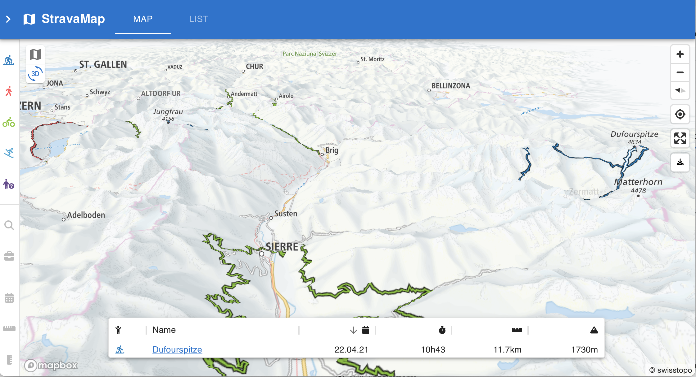
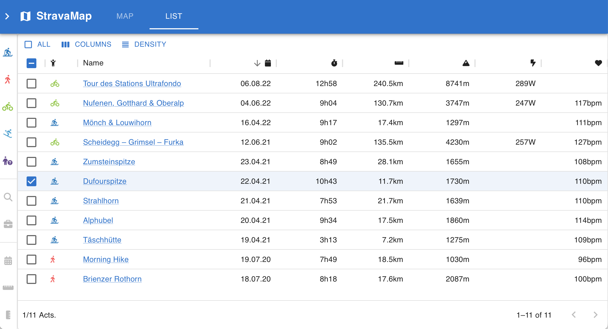

# StravaMap

Map & List of all your Strava activities.

[Example Map](https://wirhabenzeit.github.io/stravamap?activities=7593088562%2C5166477635%2C5166489085%2C5166499495%2C5172459135%2C5458243467%2C6993848803%2C7255005135%2C5177629392%2C3781386708%2C3785638208)

## Features

- Wide range of map styles and overlays
- Filter by _distance_, _elevation_, _date_, _sports type_, ...
- Automatically add/remove/update Strava activities via [webhook](https://developers.strava.com/docs/webhooks/)
- Share all/selected activities with friends & family
- Static website, no server required. All data is stored in [supabase](https://supabase.com/)

## Dependencies

- [react](https://reactjs.org/)
- [react-map-gl](https://visgl.github.io/react-map-gl/)
- [react-router](https://reactrouter.com/)
- [mui](https://mui.com/)
- [supabase](https://supabase.com/)
