# Activity-list density (#255)

Baseline: merged main `c1e8e1d`. Default row spacing is reduced while preserving aligned columns and directly sortable column headers on phones and tablets whenever the configured metrics fit. Comfortable density still permits wrapped names, while compact density remains available. The sport badge retains its separate selection action and selected state. No persisted preferences are changed.

Additional metric configurations retain adaptive stacking when columns cannot fit. Fallback rows place name/local date above aligned primary values; accessibility text keeps full sport/date/time information and stacked labelled values. Unknown and recorded-zero formatting remain unchanged.

Table rows omit the repeated actions menu; the former trailing gutter is removed so names and sortable columns can use the full width. Tap inspects without selecting. Show on map is also available through a non-full-swipe action revealed by swiping right, the native long-press menu and VoiceOver actions; GPS-less activities cannot issue it. Swipe actions are omitted in horizontally scrolling-metric mode to preserve that gesture. A bottom safe-area bar shows filtered activity and selection counts, selection actions, and list settings for sorting, columns and density. It reserves space beneath the list so the last row remains reachable. The top header retains direct column sorting. No placeholder Edit action is shown. The final separator-only styling adjustment was verified by rebuilding and regenerating all eight gallery captures.

Summaries were deliberately removed by the earlier `b0f5ddf` change. That behavior is preserved rather than reintroducing the stale summary scope in #255. No map-sheet transition work (#284/#285), tablet detail-host redesign (#273), or navigation sizing change is included.

## Matched screenshots

Eight scenes per revision use the same 20-activity fixture. Screenshots compare the current merged UI with reduced row padding, full-width sortable headers and a bottom status bar. The bar uses roughly one row of vertical space compared with the preceding header-settings iteration. Long names and large text may naturally use more height.

| Variant | Before | After |
| --- | --- | --- |
| Phone | 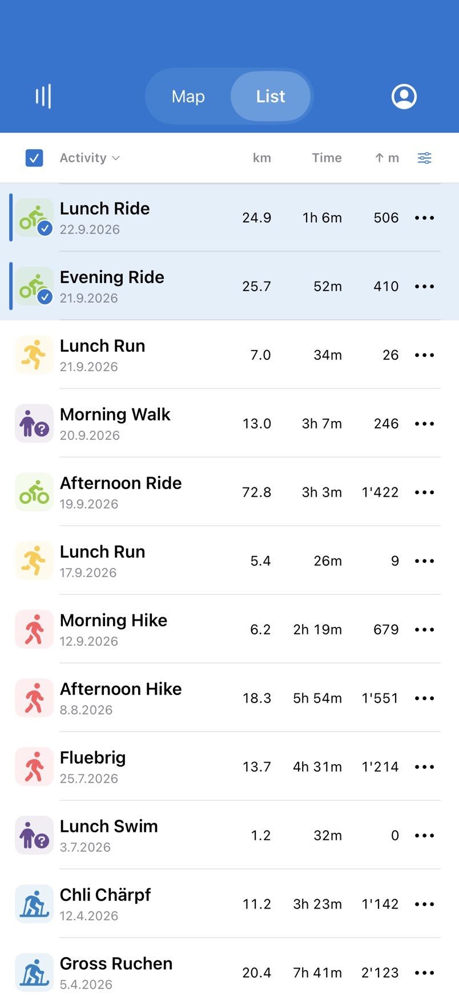 | 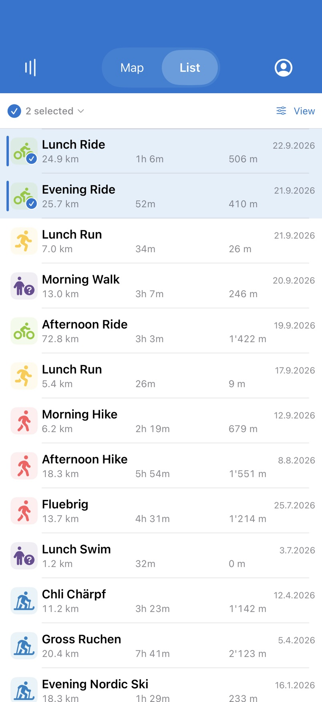 |
| Dark | 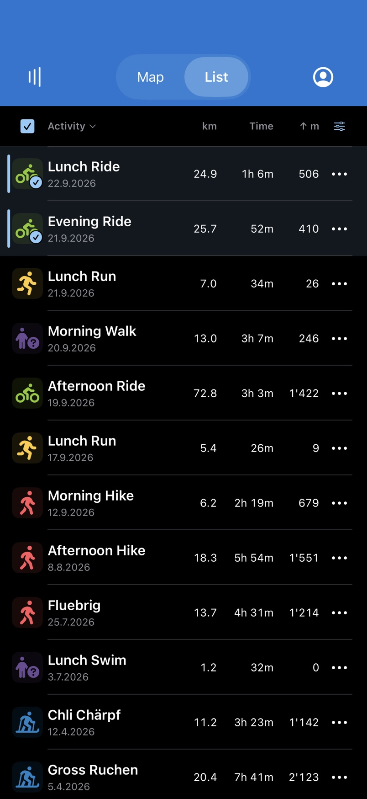 | 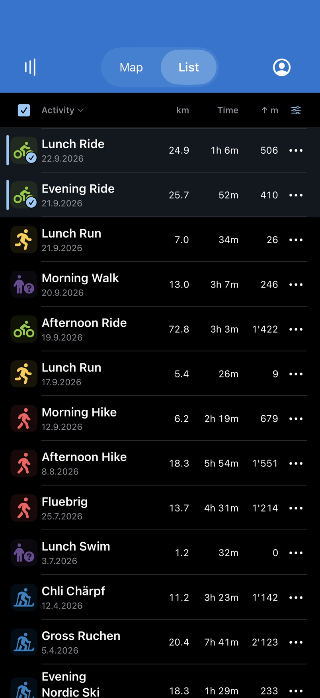 |
| Large text | 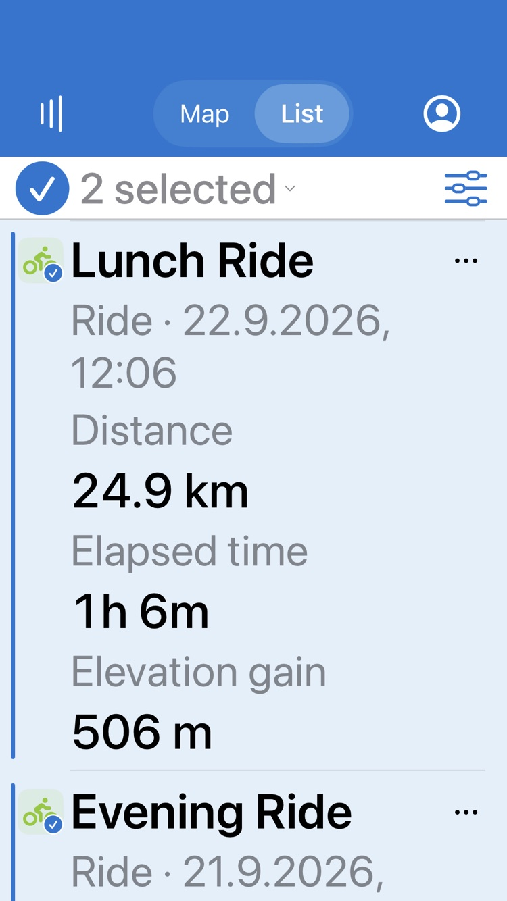 | 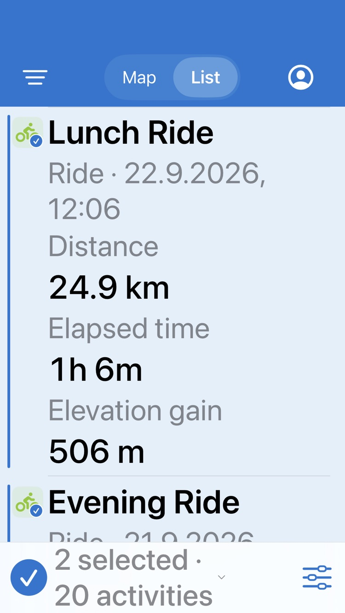 |
| Tablet | 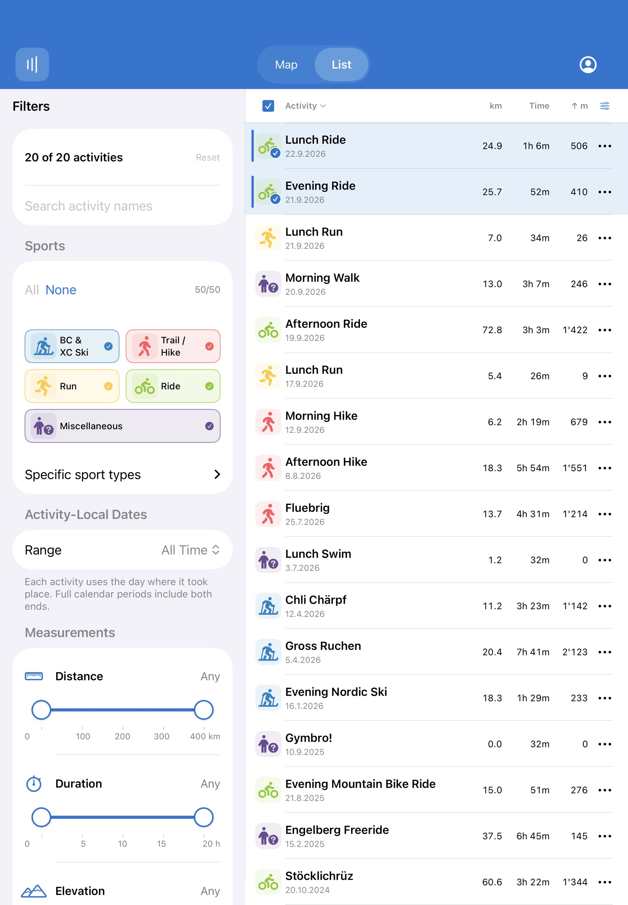 | 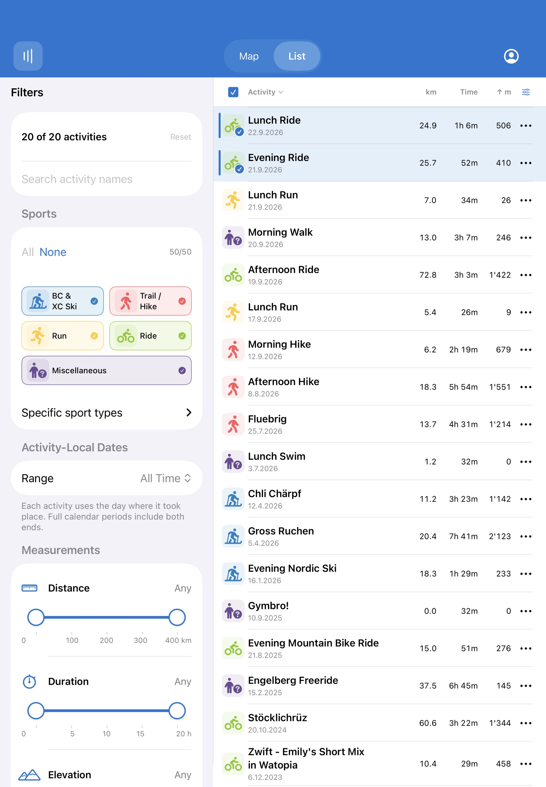 |

## Validation

With the bottom status bar and full-width columns, targeted simulator suites passed: **40 tests (109 parameterized runs), zero failures**. Coverage includes phone column fit, display-sheet retention across layout changes, sorting, preference persistence, null/zero metrics, independent inspection/selection and exact scroll retention with 2,000 lazy rows.

Result: `/tmp/activitymap-navigation-build/Logs/Test/Test-ActivityMap-2026.10.03_21-57-23-+0200.xcresult`. The earlier iteration also passed the full suite (218 tests, 348 runs); current screenshots and targeted results supersede that iteration's phone layout. Simulator evidence does not replace physical-device touch/VoiceOver acceptance.

Reproduce: `scripts/ios-gallery.sh list-density-review --scene list,list-detail --variant phone,phone-dark,small-large-text,tablet`.

## Device interaction performance follow-up

A user reported jumpy row swipes and lag during detail dismissal. The installed development build used Debug (`-Onone`); the comparison build now uses Release optimization, without changing gestures or layout.

A regression test reproduced unnecessary invalidation: changing only the inspected activity notified observers of selected IDs, active route and hidden-selection counts. Those observers include the retained map, whose route layer body constructs sorted ID filters. The store now publishes a separate selection snapshot only when selected, visible or active IDs change. Rendering callers read that snapshot; inspection still uses the existing reducer. Row context menus no longer read inspection merely to change their Details label.

The new observation test failed before the fix and passes after it. Full suite: 219 tests passed (348 runs), zero failures, two opt-in skips. Result: `/tmp/activitymap-navigation-build/Logs/Test/Test-ActivityMap-2026.10.03_22-14-09-+0200.xcresult`.

A macOS duration-formatting microbenchmark showed only a small benefit from formatter reuse (150.5 versus 131.6 ms over 10,000 calls), so no formatter change was made. This is not an iPhone animation measurement. A requested 30-second Time Profiler recording could not attach to the iPhone (device readiness timeout). The unnecessary notifications are verified fixed; reduction of visible row-swipe/detail animation hitches still needs an on-device comparison or successful trace.

## Consistent selection controls

Bulk selection actions live in the bottom status bar only. The selection-column header now sorts selected-first or unselected-first; the same sort is available in list settings. Ties retain descending activity ID order. Only selection sorting includes selected IDs in its cache key, so inspection and selection changes still reuse normal metric/date sorts.

Map result rows use their selected sport icon as a 44pt deselection button, matching the List. Tapping the name/metrics continues to open details; the separate trailing minus button is removed.

Validation: targeted sorting, selection and rendered UI suites passed (53 tests, zero failures). Result: `/tmp/activitymap-navigation-build/Logs/Test/Test-ActivityMap-2026.10.04_08-29-42-+0200.xcresult`. The first full-suite attempt stalled before launch and was terminated; the targeted retry completed after a simulator restart.

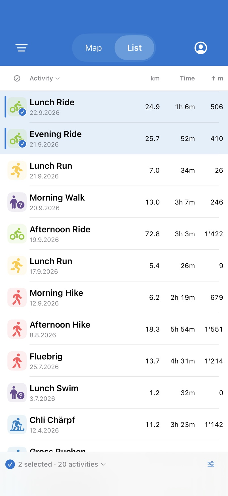

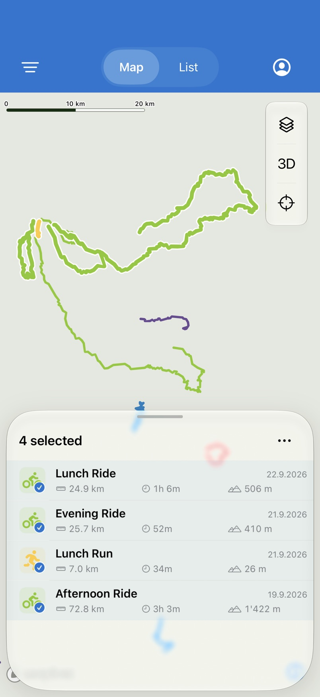

## Persistent app header during List details

The blue app header now belongs to the persistent shell layout, above the List's own native NavigationStack. Opening an activity slides detail content and its native Back bar into the List area; Map/List, filters and account controls stay visible. Back and swipe-back clear inspection while preserving selection and the retained List. Filter/account sheets retain their existing presentation, and wide list details keep their existing side-by-side or overlay behavior.

Phone light/dark, tablet, list and map gallery captures were regenerated. A rendered regression checks that the list navigation controller stays below the header, exposes native Back/swipe-back, survives a tab round trip and restores the exact scroll offset.

Validation: 31 rendered tests passed, zero failures. Result: `/tmp/activitymap-navigation-build/Logs/Test/Test-ActivityMap-2026.10.04_08-53-29-+0200.xcresult`.

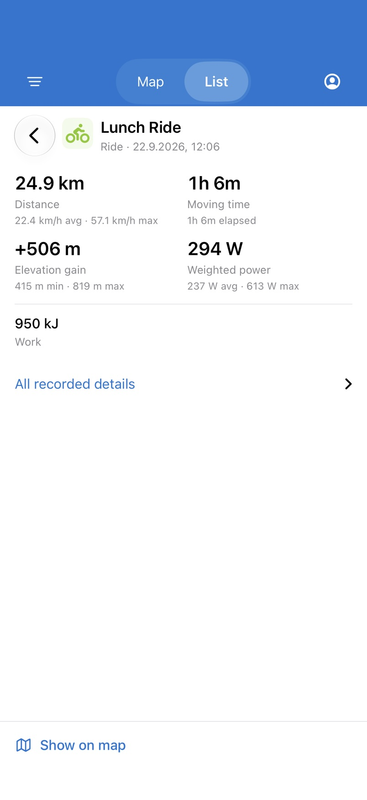

### Device follow-up: Back-bar settling and simulator sign-in

The List root now declares inline navigation-bar sizing before the first detail push, even though its own bar is hidden. A rendered check samples the Back-bar and destination frames for one second after the transition, guarding against delayed repositioning. Physical-device confirmation of the reported shift is still required.

For interactive simulator sign-in, build with normal signing (omit `CODE_SIGNING_ALLOWED=NO`). The unsigned gallery/test build lacks the simulator application entitlement and produced keychain error -34018. A separate `/tmp/activitymap-ipad-signed-build` build generates `DX96FWY9AX.page.dominik.activitymap` as its simulated application identifier. Gallery builds remain appropriate for offline fixtures, not authentication testing.

The focused `shellHeaderStaysOutsideListDetailNavigation()` test passed (one test, zero failures), including the one-second frame-stability check. Result: `/tmp/activitymap-navigation-build/Logs/Test/Test-ActivityMap-2026.10.04_09-12-55-+0200.xcresult`. Two broader attempts stalled and were terminated; no fresh broad-suite pass is claimed for this follow-up.

### Confirmed 10-point opening jump

Device feedback showed that matching inline title modes did not fix the jump. A frame trace reproduced it in the simulator: during the push, the native bar began at y=116 with a 54pt destination top inset; at approximately 0.63s it moved to y=126 and the inset became 64pt. The old stability test started after this change and therefore missed it.

List details now keep the system navigation bar hidden and render a fixed Back row within the sliding content. The existing native navigation stack and interactive-pop recognizer remain in use. A scoped UIKit gesture delegate permits edge-pop while the bar is hidden, guards root/in-flight transitions, and restores the previous delegate and enabled state when the detail disappears. The fixed button retains a 44pt hit target, glass appearance, an explicit accessibility label and the escape action.

The trace now keeps the destination top inset at zero throughout opening. The regression samples 40 frames across the animation, checks native pop eligibility and delegate restoration, and retains the scroll/tab checks. It passed, as did the separate 4,575-row navigation and window-resize checks: three focused tests, zero failures. Results: `Test-ActivityMap-2026.10.04_09-21-37-+0200.xcresult` and `Test-ActivityMap-2026.10.04_09-22-32-+0200.xcresult` in `/tmp/activitymap-navigation-build/Logs/Test/`.

### Pinned activity identity beside Back

The pushed List detail combines Back, sport symbol, activity title and date in one fixed header above the scrolling metrics. It removes the duplicate heading from the scroll view, saving a row at normal text size. Long titles use up to two lines in this pinned header; the shared identity remains unrestricted in other detail hosts. Date/type text still wraps with Dynamic Type.

The opening-frame, interactive-pop and scroll-retention regression passed (one test, zero failures): `Test-ActivityMap-2026.10.04_09-31-50-+0200.xcresult`. Light, dark and accessibility-text screenshots were regenerated; a temporary long-title fixture checked the two-line limit at accessibility size. The Release build was installed on the iPhone for review.
