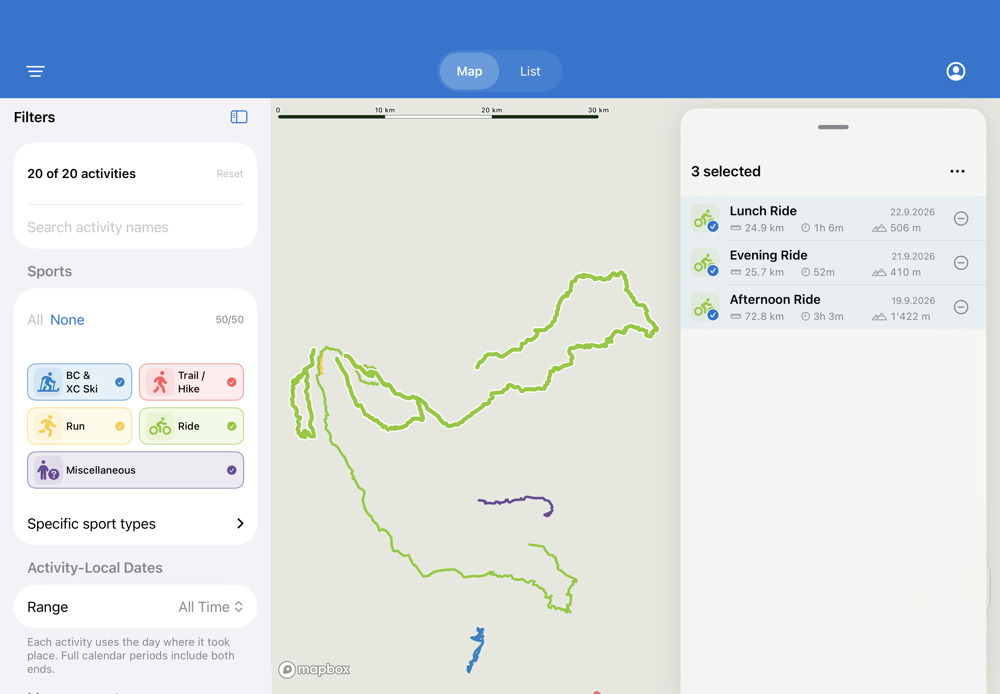
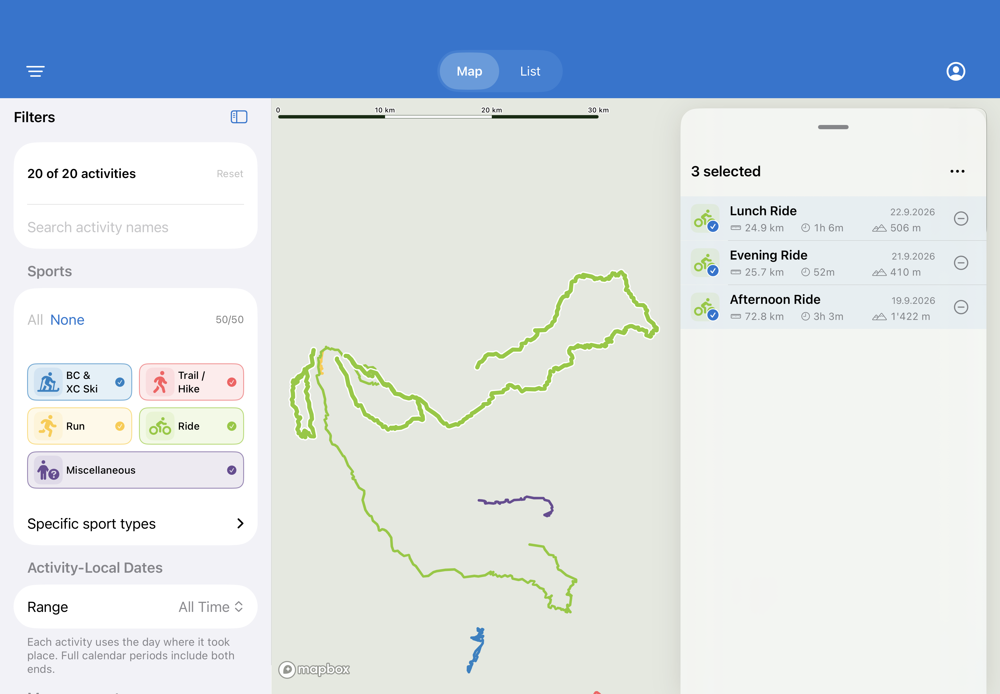
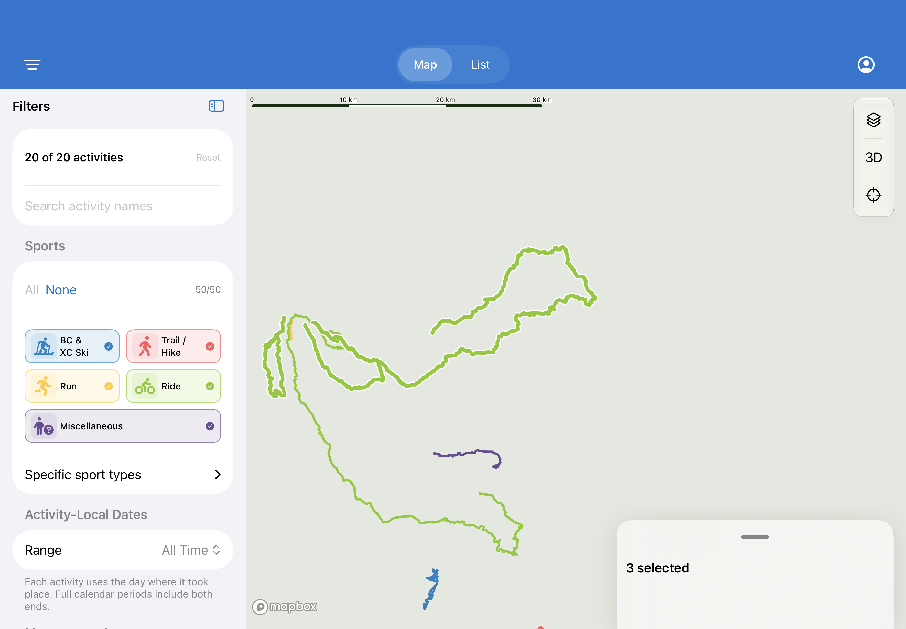
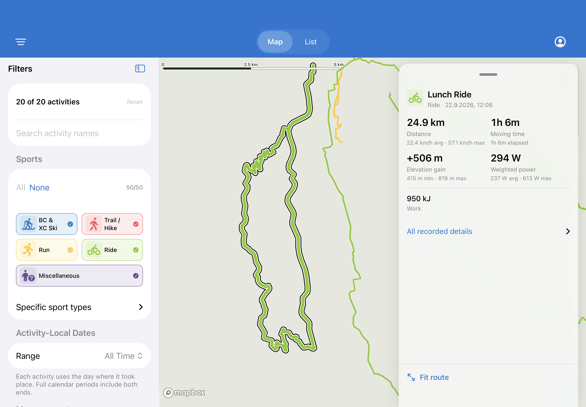

# Top-right vertical map controls (#282)

Layers, 3D and Camera now form a vertical stack 16pt from the right edge and 12pt below navigation. The existing Layers and Camera menus remain native; no new permanent control or inactive photo toggle is added.

Wide results retain their original 16pt right inset, width, height, drag snaps and bottom attachment. Expanded results intentionally cover the controls, as selected in review; no empty lane is reserved. Explicit camera-fit padding remains based on the original panel footprint. On phones, the native large results sheet can still cover controls; sheet behavior is deferred to #284/#285.

The next feature-menu extension should be photo visibility under Layers, implemented with #219 (which depends on #218), including filter-aware markers, touch previews and hit precedence. No photo implementation is included here.

| Before | After |
| --- | --- |
|  |  |

| Collapsed | Single activity |
| --- | --- |
|  |  |

Simulator/offline-style captures. Focused geometry and rendered-map validation: 37 tests passed (80 parameterized runs), zero failures. `git diff --check` passed. Result: `/tmp/activitymap-navigation-build/Logs/Test/Test-ActivityMap-2026.10.03_09-12-20-+0200.xcresult`.
