# Navigation, visual identity and fixed map panels

Review for #254, #272 and #279, captured on 2026-10-03.

The branch compacts the shared filter editor, adds the retained Stats destination/filter handoff, unifies brand and selection styling, and replaces wide-map custom dragging with an explicit bottom-right panel.

## Decisions and scope

- **#254:** keep the current single top destination control from #278; remove the unused older header/sidebar view. Search and count/reset share one section. Compact-height and accessibility filter presentations have full height and an explicit Done action. The shared editor retains all existing predicates, range validation and reset semantics.
- **Stats handoff:** #263 registers real content with `AppShell(statsContent:)`. Only registration exposes Stats; the production app continues to offer Map/List. Registered content stays mounted with map/list and resets on account scope changes. Stats uses the existing non-date predicates and engine count, shows tile-period context and saved browsing dates, and resets non-date filters without deleting those dates.
- **#272:** use #1976D2 as the brand blue, with #90CAF9 foregrounds on dark surfaces. The global accent asset now also styles native controls. Shared sport badges retain category glyphs/colors; selected rows add checkmarks and restrained blue surfaces, with a leading mark in List. Independent inspection does not select a row.
- **#279:** the owner refined the design to a bottom-right, edge-attached draggable panel on 2026-10-03. It has square lower corners and rounded top corners, with content inset above the home indicator. A 44pt handle tracks vertical dragging and snaps between collapsed and expanded heights, using predicted movement for flicks. There is no expand button; the handle supports tap, VoiceOver adjustment and named expand/collapse actions. Medium/expanded model states both use full available height. Dragging starts from the current height, clamps overshoot, and resets when cancelled. Results/detail remain mounted and the camera does not refit during resizing. Explicit fits reserve the trailing footprint. Layer controls remain in their existing position for their separate issue.

Host choice still uses the **available map viewport**, not the device name: ≥650pt width or landscape uses the bottom-right card. A portrait iPad with the 320pt Filters sidebar open can leave a narrow map that uses the native sheet. No centered native sheet replaces the existing wide edge layout.

The original native-tab-bar design and acceptance of the remaining #278 shell/filter drafts are not claimed complete here. The working Stats dashboard remains #263. Phone collapsed-summary and transition refinements remain #285/#284; map-control placement remains #282. Physical-device touch/VoiceOver acceptance remains #228.

## Matched visual evidence

The committed 20-activity gallery fixture and scene IDs are identical before/after. Baseline: main `2ca4f4a0ff6184b77030133cccf3555cad539a4f`. After: this branch's working source. Fixture SHA-256: `4e111e55d17cc53769e5a38fb08c3d50e9d9109be8c208a60c7c4f0e26d0b396`.

Captured with Xcode 27.0 / iOS 27.0 Simulator on iPhone 18 Pro. Configured host viewports are 402×874 phone, 375×667 accessibility3 and 820×1180 regular width; these are not physical-device captures. Map captures use the offline test style, not remote basemap evidence.

| Scene | Before | After |
| --- | --- | --- |
| Phone List | 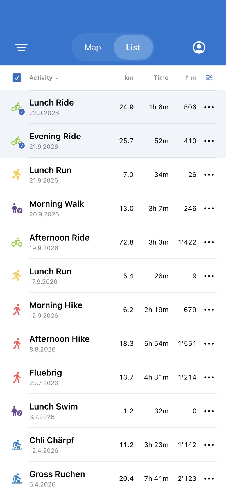 | 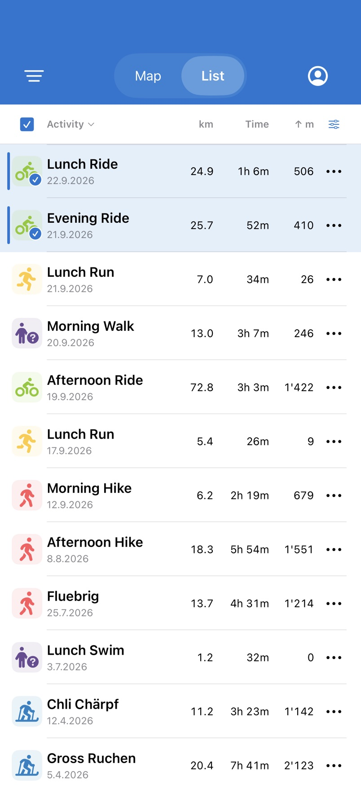 |
| Dark List | 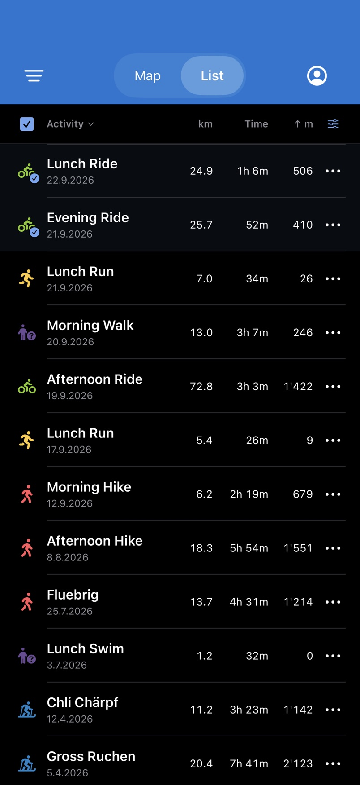 | 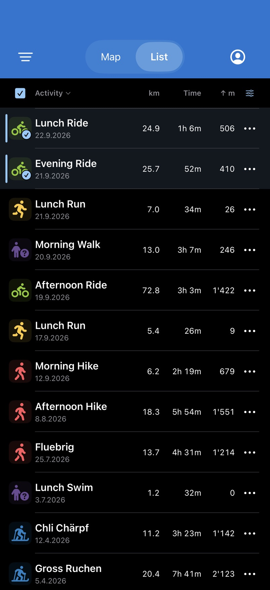 |
| Large text | 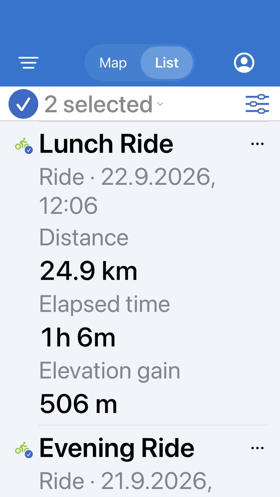 | 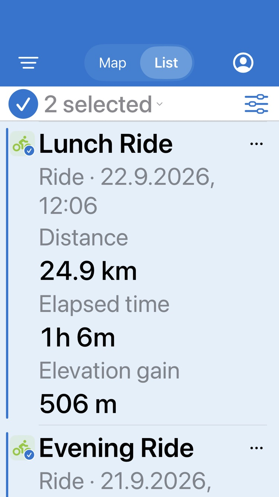 |
| Filters | 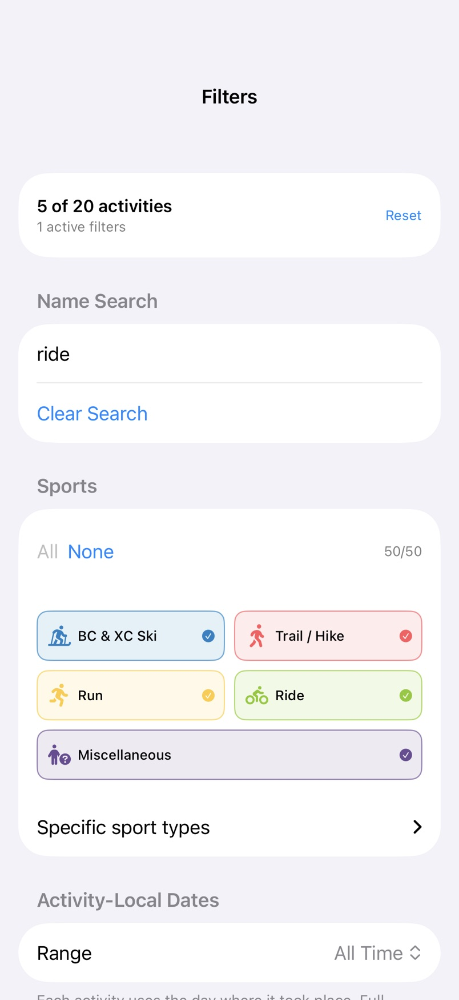 | 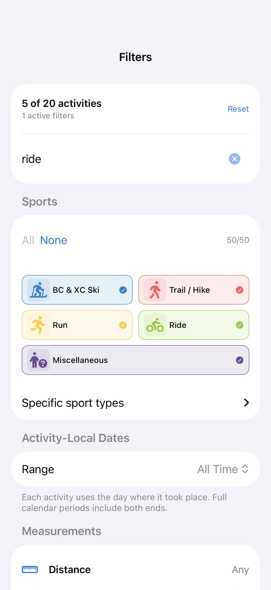 |
| Shared detail | 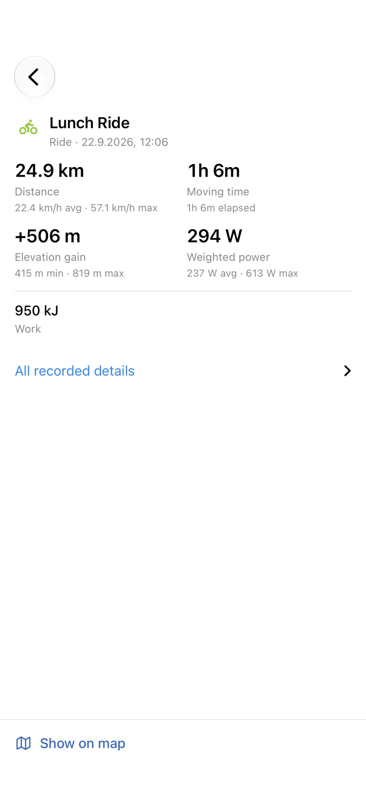 | 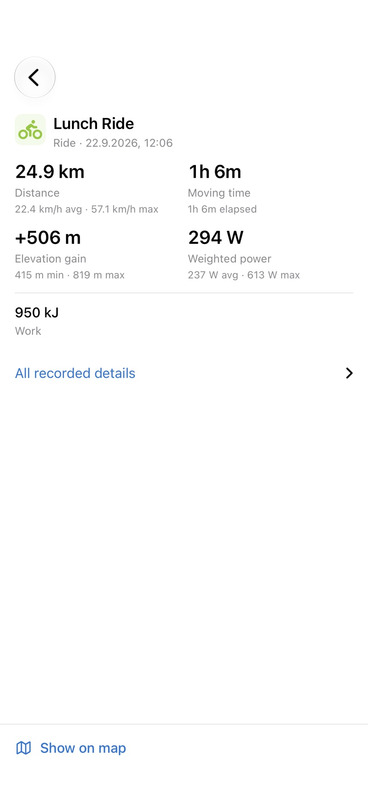 |

The Filters gallery scene renders editor content directly; it does not demonstrate the shell's Done button or modal animation. The rendered compact-height shell regression covers presentation/dismissal separately.

Single selection opens activity details directly. The following single-activity captures use the same shell and fixture.

| Expanded | Collapsed |
| --- | --- |
| 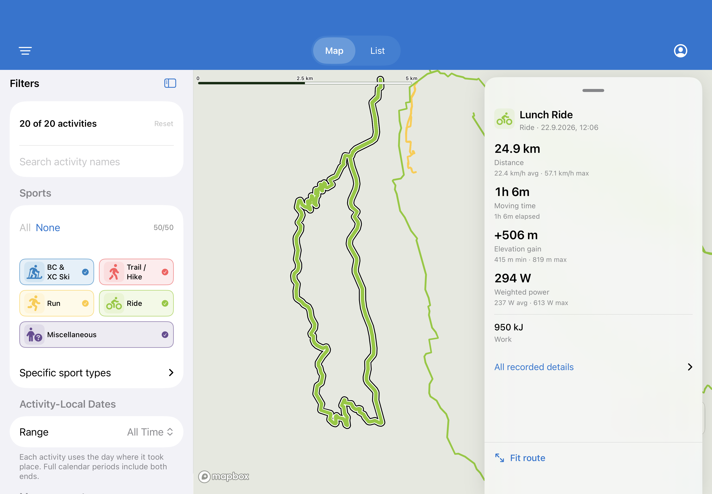 | 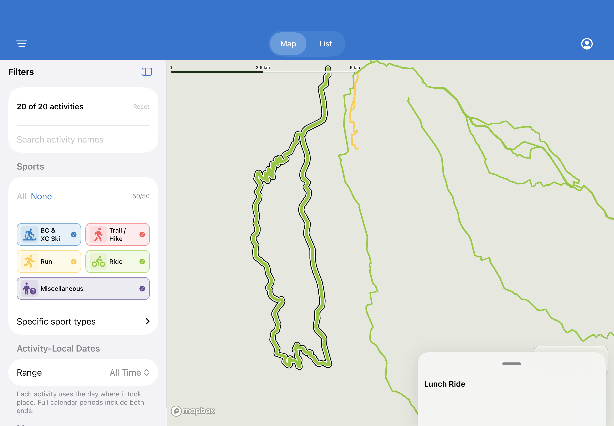 |

The 1180×820 production shell with Filters open leaves an 860pt map and uses the fixed panel. These synthetic-window captures exercise the actual shell, route renderer and camera fit, then collapse without changing the camera:

| Expanded | Collapsed |
| --- | --- |
| 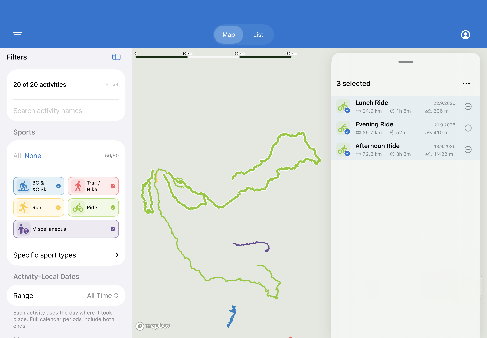 | 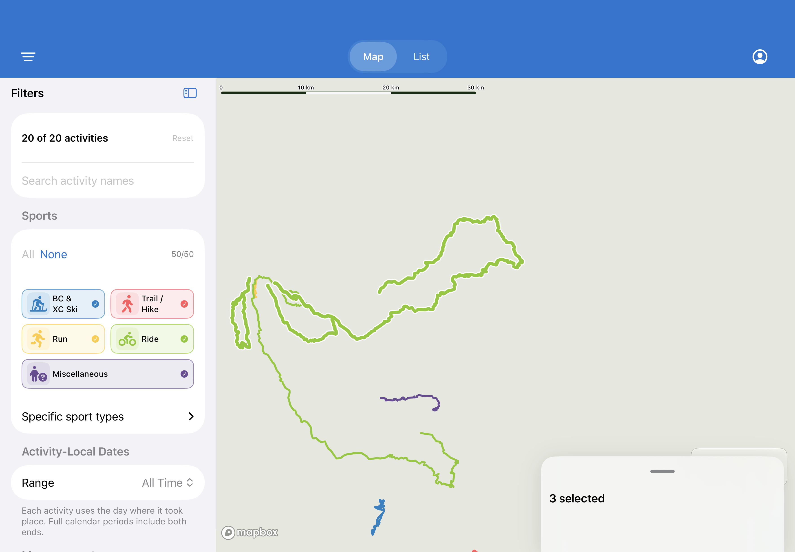 |

Local complete galleries: `/tmp/activitymap-gallery/navigation-identity-before/index.html` and `/tmp/activitymap-gallery/navigation-right-handle/index.html`, 20 captures each. The after index includes baseline comparison. Build hashes are respectively `ad333735af39617b0f1b6421d91ef01387f4d9fdd3559d0605b7699c3237e338` and `a7d3ff0bf81422be0e53b04df75c25286288abb7ab9d60788c25690a192e42e9`.

## Validation

Final run: **218 tests passed (347 parameterized runs), zero failures, two opt-in tests skipped** on iPhone 18 Pro / iOS 27.0 Simulator. Result bundle: `/tmp/activitymap-navigation-build/Logs/Test/Test-ActivityMap-2026.10.03_08-35-57-+0200.xcresult`. Both 20-capture galleries validated successfully. `git diff --check` passes.

Run the complete simulator suite:

```sh
xcodebuild test -project ios/ActivityMap/ActivityMap.xcodeproj \
  -scheme ActivityMap -destination 'platform=iOS Simulator,name=iPhone 18 Pro' \
  -parallel-testing-enabled NO CODE_SIGNING_ALLOWED=NO
```

Coverage includes drag snap prediction/clamping, right-side camera fitting, single-activity capture, and panel collapse/page retention in tablet, landscape and large text; stable camera occlusion; shared filter reset and saved dates; actual retained map renderer/List scroll/Stats scroll through the shell; full filter predicates and existing detail/selection behavior. The previous drag/reveal tests were removed with that implementation; the current two-position handle has dedicated snap tests.

The existing 2,000-row List round-trip test now waits for adjacent-detail width and lazy row-height estimates to settle before recording its offset. It still asserts exact offset retention after switching destinations. The former fixed 200ms wait intermittently sampled the layout correction itself.

Reproduce the gallery with:

```sh
scripts/ios-gallery.sh navigation-review \
  --scene list,list-detail,filters,map-results,map-detail \
  --variant phone,phone-dark,small-large-text,tablet
```
