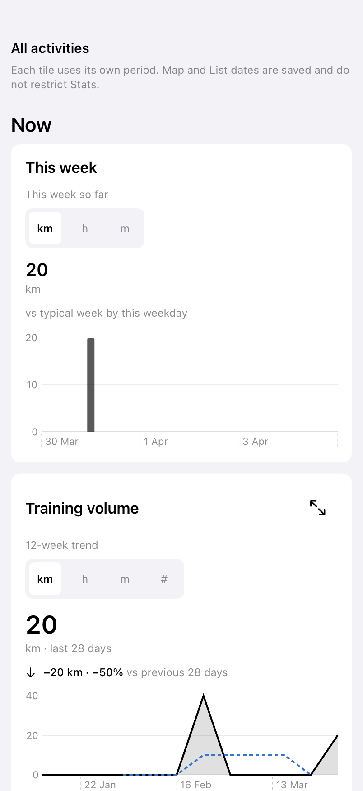
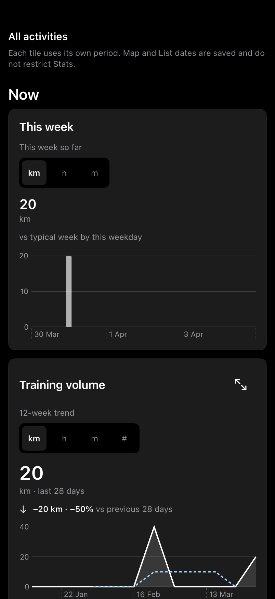
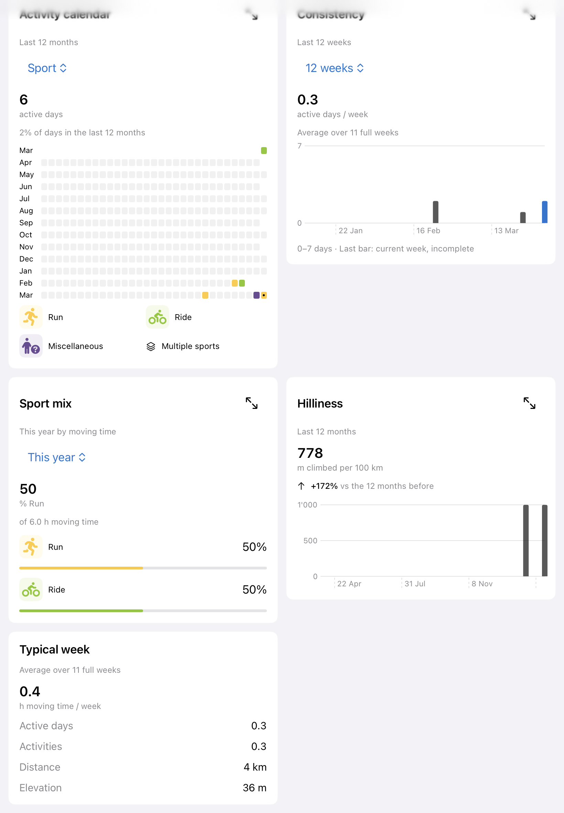

# Native Stats dashboard — #263 / #254

Reviewed implementation based on merged main `49224cdf`, updated 2026-10-09. This includes the reachable dashboard, shell/filter integration, adaptive details and cross-platform tile reconciliation. The current contract is in `docs/stats-parity-contract.md`; the dated review stages below preserve the design history. Physical-device/VoiceOver certification and measured release budgets remain #228/#229.

The [annotated navigation reference](navigation-reference-2026-10-08/index.html) compares List, Map inspection, Stats details and filters across seven native and browser layouts. Its [PDF](navigation-reference-2026-10-08/activitymap-navigation-reference-2026-10-08.pdf) contains the same three collections, a behavior matrix and team discussion questions. Download the directory to use the interactive HTML with its screenshot files. Captures use one shared 20-activity review fixture; static images do not establish animation smoothness.

## Delivered behavior

- The persistent blue shell offers Map, List and real Stats content. A native destination menu fits the same navigation into constrained widths/large text when the three labels cannot fit.
- Ten visible tiles follow **Now → This year → Patterns**, with the generated metric/range choices and capability-matrix defaults. Suppressed Totals, Consistency, Rest days, Best 30 days and optional Speed trend do not become extra tiles.
- Training volume combines the last-28-day headline with a 12-week trend and full-week four-week average. Year-end projection leads with the projected total. Records has record rows without a competing aggregate headline. Consistency is removed from both dashboards; its calculation fixtures remain.
- The rolling calendar has Sport/distance/moving-time/elevation colouring, a persistent legend, mixed-sport marks and readable date/value equivalents. It includes both rolling-year boundary dates.
- Native charts expose touch inspection in an overlay, accessible marks and calendar day descriptions without duplicate data dropdowns. The detail control pushes a dedicated scrolling screen inside the content column (cross-fade with Reduce Motion). The filter panel and shell bar stay stationary throughout expansion and Back; they are not copied into the moving destination. The persistent blue shell header retains Filters, Map/List/Stats and Settings while focused. Back and the stat title sit above the chart in the content area; regular-width focus pages retain the same filter rail or expanded panel beside the chart. Narrow windows and accessibility text use the filter sheet while focused. The dashboard stays compact and Back restores its mounted scroll position. Regular iPad windows at least 760pt wide zoom the tile into the full available content width beside filters (#353); explicit inline preview hosts retain expansion. The tile zooms into its page on every device (Reduce Motion cross-fades); the earlier Dev Push/Tile zoom comparison was removed after review. Eligible detail plots become larger, Records reveals all-time records and Sport mix reveals sport totals. Calendar detail supplies direct, full-size day controls, including empty days. There are no detail controls on This week, Year-end projection or Typical week.
- Metric/range switches keep the previous face with its original units and period until the new result is ready. A small overlaid progress indicator preserves tile height; changes of source/filter/account still hide obsolete values immediately.
- Tile choices, volume grouping/totals, Records period, calendar year/day and mounted scroll context survive destination switches. Switching to Map from an inspected activity closes the Stats destination. Account-scope changes dismiss detail and discard inspection state. Stats applies shared non-date predicates; its reset preserves the saved Map/List date range, selection and browsing context.
- First load, no history, no matches, partial history, authorized offline cache and error-with-content remain distinct. Account/retry actions call the existing shell and sync recovery. Expired/disconnected scopes do not display stale dashboard values.
- Ten compound tile queries fit the existing sixteen-entry result-cache budget. Aggregation uses the production engine off-main. Visible values are tagged with source scope/revision, non-date predicates, reporting day and tile option; obsolete results cannot publish. Stats demand starts when selected, and does not fetch streams, images or route geometry.
- The unused Calendar/Timeline/Progress prototype views were removed.

## Review captures

The iPhone detail transition was revised on 2026-10-07 for #347. A physical-device recording of the initial matched-source zoom showed a 64pt downward content jump at completion. A standard push reduced this to 10pt, but showing the native bar still changed its inset when navigation finished. Stats now keeps its Back row inside the pushed page with the native bar hidden, following List detail; both share the existing guarded native edge-swipe helper. The regular `phoneNavigationKeepsContentPosition` regression measures the scroll viewport, content origin and insets during push and Back, and verifies gesture delegation is restored on exit. All 33 targeted Stats tests pass. Portrait, landscape and accessibility-text frame captures through the production shell show constant content position, including at transition completion. The same three cases pass with the local 4,578-activity library, and List detail’s existing navigation/gesture regression also passes after sharing its helper. This is simulator evidence; the updated dev build still needs physical-device review. Opt-in PNG capture uses `ACTIVITYMAP_STATS_NAVIGATION_FRAMES=1` and `ACTIVITYMAP_STATS_NAVIGATION_OUTPUT` in `RenderedStatsDashboardTests`.

The follow-up latency check found avoidable work before the push: the dashboard's inline-expansion scroll observer still read the selection on iPhone, invalidating the compact dashboard when opening detail. That observer now reads the selection only for inline presentation. In matched Release simulator runs with the local 4,578-activity library, the median time until the main thread's first display callback fell from 177ms to 68ms for Training volume and 176ms to 65ms for This month (three openings each; no new Stats calculations). This measures the initial UI stall, not the entire tap-to-animation delay; destination chart construction still takes time. The opt-in `measurePhoneNavigationStart` test (`ACTIVITYMAP_STATS_NAVIGATION_LATENCY=1`, output path `ACTIVITYMAP_STATS_NAVIGATION_LATENCY_OUTPUT`) also samples destination visibility through ancestor presentation transforms. Its callback timestamps bound visibility from above when the main thread is busy. All 34 targeted checks, including this diagnostic, pass with the larger library; content positions stay stable through push/Back and iPad expansion is retained.

The subsequent report of a pause before Back movement exposed a chart hotspot in a Debug main-thread sample: `StatsSeriesChart.isReference` rebuilt the distinct series list for every point, making long line charts quadratic. It now compares against the first point's series, which is the same first distinct series, in constant time per mark. In matched Debug simulator runs with the same 4,578-activity library, first Training volume Back movement fell from 619ms to 132ms and median Year-to-date opening from 863ms to 206ms. Warm Back observations still cluster around 100ms; these display-link observations remain upper bounds, not physical-device latency measurements. The diagnostic now observes both opening and returning views, because UIKit can detach the outgoing view while animating snapshots.

The phone install script had been using unoptimized Debug builds while the earlier simulator comparison used Release. `scripts/install-dev-iphone.sh --release` now provides an optimized build with the same ActivityMap Dev bundle, icon, authentication callback and production server. Debug remains the script's default. Use the optimized Dev build for physical responsiveness review.

Final optimized simulator validation completed the regular checks in both Stats suites, including all three phone navigation geometry variants. The combined run's timing diagnostic was interrupted by a simulator restart; its isolated rerun passed all 24 push/Back observations with zero new Stats calculations. Captured content origin, viewport height, inset and offset remain constant through push/Back in portrait, landscape and accessibility text. Release timing observations still show roughly 140–280ms before visible movement, so the chart improvement does not establish an instant transition or a physical-device result.

After the user reported much better responsiveness, the tile-to-detail zoom was restored for another phone review. Each expandable iPhone tile is a matched transition source with the surface's rounded corners, and the destination uses that tile's ID in a shared namespace. The detail retains the hidden native bar, its own Back row, fixed chart layout and the chart performance fix. Reduce Motion still cross-fades; iPad retains inline expansion. All 34 Stats checks pass with the 4,578-activity library, including stable detail insets/content positions during opening and returning in portrait, landscape and accessibility text. A separate simulator compositor recording confirms the zoom plays from and back into Training volume; its portrait frames were inspected for the old completion jump. The signed optimized ActivityMap Dev app was installed and launched on the paired iPhone using `scripts/install-dev-iphone.sh --release` after it reconnected. Physical-device review of the restored zoom remains necessary.

The physical follow-up recording `ScreenRecording_10-07-2026 11-02-57_1.mov` exposes a separate clipping defect. The decoded 315-frame sequence shows Records opening to its final content layout while retaining large rounded bottom corners; between 2.216667s and 2.233333s the corner cutouts disappear abruptly without moving the content. Earlier geometry regressions do not cover this transition mask. Back contracts directly toward Records, while the interactive swipe also shrinks the page but translates it to the right with the gesture: both visibly use zoom, with different paths. The mask appears to be a native transition overlay; that ownership and a remedy still need an isolated experiment, beginning with removing the explicit matched-source clip configuration. Review frames, timestamps and corner crops are retained locally in `/tmp/activitymap-stats-zoom-phone-review`.

The requested corner experiment removes the explicit `matchedTransitionSource` rounded-rectangle configuration and uses the default source modifier. The existing phone geometry and retained-state checks pass in portrait, landscape and accessibility text, and the iPad inline-expansion check passes (three tests, seven parameterized cases). The simulator compositor still shows rounded corners on the zoomed destination: removing this source configuration does not disable the native transition mask, so the corner snap is not established as fixed. The optimized ActivityMap Dev build was installed using `scripts/install-dev-iphone.sh --release`; launch was refused because the phone was locked. Open the installed Dev app for the physical comparison. Simulator captures and recording are retained under `/tmp/activitymap-stats-corners-347-*`.

The next user-approved revision moves iPhone Stats navigation around the whole shell, including its blue header. The native bar is visible on both root and detail, keeping its inset consistent: Filters and the destination picker become Back and the stat title through the native navigation transition. The account button remains available, with Settings presented by the whole stack. This revision uses ordinary horizontal push/Back as the baseline and removes matched-source zoom; Reduce Motion cross-fades. iPad retains the custom shell header, sidebar and inline expansion. The detail's own loading task keeps metric changes responsive while SwiftUI leaves the pushed dashboard inactive; both use the same observed state and result cache. Shell sync/foreground tasks now belong outside the pushed root. Account changes dismiss detail and reset inspection; Show on map returns to Map. Dashboard/list scroll positions, metric and inspection choices remain retained.

Validation of the contextual header: the optimized simulator build passes **320 tests across 42 suites**, including constant bar height/content geometry through push and Back in portrait, landscape and accessibility text, all expandable destinations with the 4,578-activity library, metric loading while pushed, retained inspection/scroll state, account-scope invalidation, Settings from detail and existing Map/List behavior. The opt-in `reviewPhoneStatsHeaderGestures()` check (`ACTIVITYMAP_STATS_HEADER_INTERACTION=1`) passed with actual Device Hub input: UIKit reported a cancelled interactive pop, retained the detail selection/header, and the toolbar Back button restored the original dashboard offset. A second interaction run passed, but the automation's longer drags also cancelled; completed edge-swipe behavior remains for phone review. Local captures are in `/tmp/activitymap-stats-263-preview/phone-header-*.png`. The signed optimized ActivityMap Dev app was installed on the paired iPhone using `scripts/install-dev-iphone.sh --release`; iOS refused launch because the phone was locked. Open Dev for the physical comparison.

The user subsequently reported the profile button jumping at transition completion and accepted removing it if keeping it stable proved unreliable. The simulator's placeholder button retained its center in the original implementation, so that check did not reproduce the physical avatar artifact. A shared toolbar item on the navigation stack did not appear reliably in the rendered header. The final revision instead keeps Profile on the overview and omits it from pushed stat detail, leaving only Back and the stat title. Three targeted tests across two suites pass: the rendered regression verifies its absence on detail and its original position after returning, alongside the existing stable content geometry in portrait, landscape and accessibility text; shell sheet presentation and List navigation also pass. Frame captures are retained in `/tmp/activitymap-profile-detail-removed`. The optimized Dev build was installed on the paired iPhone; iOS again refused launch while locked.

The requested slow-motion comparison uses the opt-in `captureListAndStatsNavigationMotion()` diagnostic (`ACTIVITYMAP_DETAIL_MOTION_COMPARISON=1`). Both modes use the same production AppShell, 402×874 viewport and 4,578-activity library, with two push/Back repetitions. A simulator compositor recording captures the actual transition without hierarchy snapshots or forced layout; a display link records presentation-layer motion. Both report a 350ms native transition duration and nearly identical body trajectories. In the second repetition, the first observed movement is approximately 179ms/154ms for List push/Back and 328ms/280ms for Stats; these are simulator callback observations, not phone latency guarantees. The visual distinction is the header: List detail covers the browsing bar and its header moves with the page, while Stats retains a stationary native bar and transitions its controls separately. The earlier source-based description of List keeping the blue bar visible does not match the compositor recording. The passing diagnostic, timestamps, full recording and action-aligned quarter-speed side-by-side video are retained in `/tmp/activitymap-detail-motion-comparison`.

The user preferred the blue Stats appearance with List's coordinated page motion. Stat detail now contains its own blue Back/title row, including the blue top safe-area background, and hides the native navigation bar like List detail. Header and charts travel together in the ordinary push/Back; Profile remains on the overview. The explicit default animation transaction and automatic transition modifier are unnecessary for normal phone navigation and were removed; inline iPad expansion keeps its existing animation, and Reduce Motion retains the cross-fade modifier. The optimized simulator passes **38 tests across three suites**, including all expandable destinations, retained metric/history/scroll state, stable content geometry in portrait/landscape/accessibility text, Settings presentation and List navigation. In-flight checks allow the overview's native bar to return during Back while still requiring constant outgoing detail geometry and a hidden native bar on settled detail. Compositor frames confirm the blue header travels with the detail page; recording and quarter-speed comparison are in `/tmp/activitymap-blue-page-motion`, with geometry captures in `/tmp/activitymap-blue-page-final-geometry`. This fixes the independently animated header, not the remaining chart-related startup cost: second-repetition simulator observations still show about 312ms/267ms before Stats push/Back movement versus 183ms/175ms for List. The OS Reduce Motion setting was not independently exercised in this run; its read-only SwiftUI environment value cannot be overridden by the rendered test. The optimized ActivityMap Dev build was installed on the paired iPhone using the script; iOS refused launch while locked. Physical-device review remains necessary for perceived responsiveness.

The follow-up exposed grey cutouts around the moving blue header. Both List and Stats detail now use blue headers with white controls. A noninteractive shell overlay keeps only the portrait top safe-area background blue, while the title row and content still move as one native page. The compositor recording in `/tmp/activitymap-header-corner-status` confirms a continuous blue top area through portrait opening. Actual scene rotation in the motion diagnostic (`ACTIVITYMAP_DETAIL_MOTION_LANDSCAPE=1`) exposes a remaining landscape limitation: with no top safe-area band, UIKit's rounded page transition still reveals the grey cutout. Navigation-container background and transition-backdrop experiments did not resolve that case and were removed. Native animation/edge-swipe ownership is retained; this iteration does not claim a landscape corner fix or new physical swipe verification. The final optimized simulator run passes **38 tests across three suites**, using the full local library for the rendered destinations; whitespace checks pass. The script installed the optimized Dev app on the paired iPhone, but iOS refused launch while locked.

The subsequent physical screenshot `IMG_0326.jpg` shows a black transition-shadow seam across the custom blue header in dark mode. Both Stats and List detail now keep the blue chrome in the native navigation bar, with the root and detail bars continuously visible. The fixed status-area overlay and sliding custom header rows are removed; Back/title transition with UIKit's bar and the content slides below it. The dark-mode compositor recording in `/tmp/activitymap-native-blue-dark-motion` shows no seam in the blue area during push/Back. Stats also removes all sync/loading/incomplete-history/offline/error/filter-summary banners and Retry sync rows above the tiles. Filter status/reset stay in the Filters control and panel. Completed empty states retain no-history/no-matches feedback; transient sync details belong in Settings. The existing cached/error/auth rendered regression now checks retained scroll offset through sync-status changes, as well as retaining authorized values and clearing them on disconnection. An attempted total-content-height assertion was too broad for this scenario and was removed; total layout changes during the underlying sync lifecycle even after the banners are removed, so this is not a claim that all sync-related tile layout is invariant.

Validation of the native-bar revision: 37 checks passed in the broad Stats/List run, and the revised cached/error/auth scroll regression passes on its targeted rerun. Dark portrait and actual landscape compositor recordings show a continuous blue navigation area without the former corner gap/shadow seam; landscape evidence is in `/tmp/activitymap-native-blue-dark-landscape`. The optimized Dev build, including the removed filter-summary banner, was installed with the script; iOS refused launch while locked. Completed/cancelled physical edge swipes were not independently rechecked in this iteration.

The follow-up recording `ScreenRecording_10-07-2026 22-54-24_1.mov` showed the List toolbar map button beside the title and the Map activity sheet appearing over the outgoing List detail. The icon now occupies the trailing toolbar slot. Show on map from pushed List detail clears that inspection and ends its native stack immediately using the public nonanimated pop API, before Map can present its card. A weak navigation reference comes from the existing back-gesture bridge; other Map/tab commands and selection behavior are unchanged. A SwiftUI transaction flag alone did not suppress the native pop. The rendered handoff test checks that no Map sheet appears during a transition from the outgoing detail, retains the selected activities and targets the correct activity. The final 14 checks across selection and rendered List suites pass; actual toolbar placement and Map-first/card-after ordering are confirmed in `/tmp/activitymap-list-map-handoff-native-recording`. The optimized Dev app was installed and launched on the paired iPhone.

The next recording, `ScreenRecording_10-07-2026 23-17-24_1.mov`, exposed the instantaneous route-camera fit: the old camera appeared, followed by a blank frame and the final camera. Route fits now use one 500 ms ease-out transition for center, zoom and final results padding. A viewport-animation change inside the navigation/results update still jumped in rendered tests; scheduling it in a separate main-queue update preserves the animation transaction. A transition identifier discards superseded or no-longer-visible queued changes. Projection is reset only when the map is not already Mercator. The revised handoff regression passes with both Mercator and globe starting styles, asserting intermediate cameras, bounded zoom steps, retained MapView identity, final route containment and correct sheet ordering. The production Map/List round-trip also passes; the existing route-fitting math checks passed during this iteration. Compositor evidence is in `/tmp/activitymap-smooth-camera-deferred-recording`. These tests use an offline style and do not establish production imagery loading behavior. The optimized Dev build was installed on the paired iPhone; launch was refused while the device was locked.

For another requested phone A/B comparison, the accepted push implementation was committed first as `dad01984` on `codex/stats-navigation-ab`. The subsequent experiment adds an iPhone Dev-only **Settings → Stats animation comparison** control: **A: Push** (default) and **B: Tile zoom** share the same full detail destination, blue native navigation bar, retained dashboard and chart performance fixes. B uses a tile ID and shared namespace with the default matched source; no extra rounded-source configuration is applied. The choice persists on the device and switches without reinstalling; production stays on push, Reduce Motion cross-fades and iPad stays inline. Eighteen tests across two suites pass, including six portrait/landscape/accessibility push/zoom cases and an actual Dev preference cycle Push → Zoom → Push that checks the native preferred transition, exact root scroll retention and no new Stats calculations. The Settings control was inspected in its rendered Form. An additional opt-in compositor recording with the 4,578-activity library confirms B opens from and returns to Training volume with continuous blue chrome; evidence is in `/tmp/activitymap-stats-ab-zoom-recording`. This is an experiment for physical-device comparison, not a decision to replace push; native interactive zoom swipe behavior remains for phone review. The optimized ActivityMap Dev build was installed and launched on the paired iPhone with `scripts/install-dev-iphone.sh --release`.

On 2026-10-08, the user clarified that the iPad simulator should also use the Push/Zoom comparison. Dev now automatically uses the same whole-shell detail navigation on iPad and exposes the A/B setting there; explicit inline hosts and production iPad retain inline expansion. The live preference regression passes on the actual iPad Pro 11-inch simulator in both phone-sized and tablet-sized hosts, including Push → Zoom → Push, native transition selection, exact dashboard scroll retention and cached calculations. The existing inline tablet regression also passes. The signed optimized Dev simulator build uses the production backend and its own bundle beside the existing local-backend app.

Following the iPad review, Stats now opens chart details beside the dashboard in regular windows at least 760pt wide, retaining the blue shell bar and highlighting the selected compact tile. Detail uses 56% of the width, bounded to 430–680pt; Stats filters use the filter sheet to leave room for both panes in portrait. Narrow windows and accessibility text sizes use navigation. An already-pushed detail stays pushed through widening until Back; wide-window tile switches and close retain the overview, cached calculations and inspection choices. The shared detail content supplies charts, controls and activity inspection to both presentations. Dev Push/Zoom comparison remains available for phone and narrow-window navigation; explicit inline preview hosts retain expansion.

Validation: twelve cases across five rendered tests pass on the iPad Pro 11-inch (M5) simulator: portrait/landscape panes, resizing into navigation and back to panes, six phone Push/Zoom variants, two live Dev preference hosts and the explicit inline regression. Both pane captures were visually inspected at `/tmp/activitymap-stats-263-preview/ipad-stats-pane-portrait.png` and `ipad-stats-pane-landscape.png`. The signed optimized Release Dev app was installed and launched on the same iPad simulator, preserving its production-backend configuration.

The subsequent iPad filter review exposed a regression: the native root toolbar and its sheet presenter still forced the phone presentation while Map/List displayed their filter sidebar. All filter entry points now share the current width, size-class, text-size and tab policy. Wide Map/List toggle their sidebar and suppress duplicate filter sheets; widening a narrow window dismisses an open filter sheet. Stats keeps filters in its sheet. Eight cases across rendered filter, Stats pane and Map results-stacking checks pass; the wide List capture was visually inspected. The corrected signed Release Dev app was installed and launched on the iPad simulator.

The next iPad refinement makes filters consistent across Map, List and Stats: regular windows at least 760pt wide use the left sidebar; smaller windows and accessibility text sizes use the filter sheet. Opening List or Stats detail automatically hides filters when filters plus the two content panes would not fit, without changing the saved sidebar preference. Closing detail restores that preference. While detail is open, the toolbar can reveal filters over the overview without shrinking the detail; sufficiently wide windows retain all three columns. Detail eligibility uses the full shell width, avoiding an accidental push when the filter sidebar changes the content width. Twenty-two cases across ten rendered tests pass, including all-tab sidebar/sheet policy, narrow-to-wide sheet dismissal, portrait/landscape and manually hidden List filters, Stats pane/filter reveal/scroll/cache retention, resize/push retention, six phone Push/Zoom variants and Map sheet stacking. The portrait, landscape and temporary filter-overlay captures were inspected. These verify hosted layouts and retained state; they do not measure physical-device transition smoothness.

On 2026-10-09, after the navigation review in #351, the user chose a full-width Stats focus page over the right-hand chart inspector, because the inspector showed charts narrower than the tile that opened them (#353). Every width now pushes the same page through the shell stack, and the user also settled the Push/Tile zoom A/B in favour of zoom. The Dev setting, its preference key and its tests are removed. Stats no longer borrows the filter column, and on wide, tall pages expanded charts grow to about 45% of the page height (capped at 520pt). Making the focus page show more than a bigger chart at regular width is tracked in #360.

The captures use the unchanged `sparse-null-zero-and-ties` dataset from `shared/stats-parity-fixtures.v1.json`, reporting day **2026-03-31**, through the real engine and `StatsScreen`. They are synthetic hosted SwiftUI evidence, not authenticated production screenshots or physical-device certification. Phone windows are 402×874; tablet is 820×1180. The rendered suite additionally captures 844×390 landscape and 375×812 accessibility3, plus expanded charts and actual sync cache/error/unavailable transitions.

| Phone overview | Dark overview |
| --- | --- |
|  |  |



Reproduce the targeted captures:

```sh
xcodebuild test -project ios/ActivityMap/ActivityMap.xcodeproj \
  -scheme ActivityMap -destination 'platform=iOS Simulator,name=iPad Pro 11-inch (M5)' \
  -parallel-testing-enabled NO \
  -only-testing:ActivityMapTests/RenderedStatsDashboardTests CODE_SIGNING_ALLOWED=NO
```

These original baseline captures predate reconciliation and remain historical evidence. Current captures are written to `/tmp/activitymap-stats-263-preview`; `scripts/stats-tile-gallery.sh` produces matched tile-only web/native reviews. The shell round-trip test uses real dashboard content; the existing renderer suite also exercises it alongside a real Mapbox renderer and retained list offset.

## Validation

- Interaction follow-up: **12 native tests in 2 suites and 13 web Stats UI tests passed**. The new rendered regression holds a metric request pending and verifies unchanged dashboard height and scroll offset; the state regression checks rapid choices, value/unit pairing and scope invalidation. Web Consistency keeps its duplicate weekly counts table for screen readers only; history Period totals stays visible because it adds combined totals to sport charts.
- `StatsDashboardTests` checks the visible capability matrix, defaults and every declared switch; shared expected comparison fixtures; cache reuse and scope/date/selection retention; and late completion after a scope change.
- `RenderedStatsDashboardTests` hosts real tiles across five layouts, exercises shell round trips and Stats filter reset, and renders real offline/failure/authorization transitions.
- `StatsScopeTests` now exercises every dashboard option against eligible stream metadata and asserts zero summary/sync demand and unchanged route geometry builds.
- Shared Stats fixture/scope and shell foundation tests remain the calculation/lifecycle baseline.
- Generated Stats definitions, Swift API DTOs and map catalogue checks pass; `git diff --check` passes.
- Final full simulator run: **233 tests across 31 suites, zero failures** on Xcode 27.0 / iOS 27.0, iPad Pro 11-inch (M5) simulator. The live-server and opt-in gallery tests were skipped. This includes the real Mapbox/List/Stats round-trip and all existing native lifecycle/browsing suites.
- Local result bundle: `/tmp/activitymap-stats-263-build/Logs/Test/Test-ActivityMap-2026.10.04_10-43-15-+0200.xcresult`.

## Follow-up boundary

The accepted #264 details and #265 tile reconciliation are implemented here: volume grouping, calendar navigation, record/hilliness/calendar activity links, historical context bands and shared iPad expansion. Earlier plans for paged month/year comparisons and extra selected-year curves were superseded by current-versus-previous comparisons. #254 integration tests do not certify the remaining physical-device/accessibility work under #228; release performance remains #229. The following review notes are chronological and include proposals superseded by later decisions.

## Reconciliation review — 2026-10-04

Review basis: the 38 tile-only captures produced by `scripts/stats-tile-gallery.sh`, using the same 20 curated activities, reporting day 2026-09-22, default choices, light appearance and 378pt/CSS-pixel cards. This is a proposed design direction, not an approved implementation specification. The sparse fixture is useful for revealing empty periods but must be supplemented with dense and mixed-sport histories before final chart decisions.

### Shared direction

Use the web's concise hierarchy and wording as the starting point, with more useful chart space than its smallest cards. Keep native touch targets, Dynamic Type, readable labels and smooth transitions. Match information, periods, formatting and interaction intent across platforms; let controls adapt to their platform and available width.

- Title and expansion control on the first row; period and compact metric/range control share the next row when they fit. Wrap intentionally at large text sizes rather than forcing fixed heights or shrinking targets.
- Put a value and its unit/context together: `58 km so far`, not three separate vertical blocks. One short comparison line follows. Remove duplicate period wording and generic `History & details` labels.
- Trial a 100–120pt plot in ordinary collapsed chart cards, then measure the whole card. Do not force all tiles into either the web's 220px or native's current content heights. Use consistent content families (ordinary plot, calendar, text summary).
- Use meaningful x-axis intervals: weekday names for daily bars, week starts for weekly bars, months for monthly/yearly plots. Bars fill their categorical period rather than becoming needles on a continuous date axis. Include half-bin room at the edges.
- Trial a restrained y-axis: two or three useful ticks and light rules in collapsed charts, fuller scales in detail. Keep zero baselines for bars and the fixed 0–7 scale for active days. Do not globally apply one axis treatment to every chart.
- Keep signed numerical comparisons. Use the web's green emphasis selectively for increasing volume, without making all increases (especially hilliness) look inherently desirable or all decreases alarming.
- Mark a partial period on the mark itself and in its inspected value. Omit repetitive collapsed disclaimers, but retain an accessible explanation and a clear expanded indication. Preserve distinctions between no activity, missing measurements and future dates.
- Expansion should preserve metric, explain the same subject more fully, animate without moving its header unexpectedly, and retain state on return. Change a headline's time window only with an explicit visible label. Keep scope/auth invalidation and pending-result/unit pairing intact.

### Tile decisions

| Tile | Stronger aspects today | Proposed combined direction |
| --- | --- | --- |
| This week | Web: weekday labels, wider bars, inline picker, `58 km so far` and short comparison. iOS: usable chart height and magnitude scale. | Adopt web structure and wording; give bars 100–120pt of plot height, clear Mon–Sun positions, a restrained scale and a distinct today/partial treatment. Future days remain unelapsed. No expansion needed. |
| Training volume | Web: concise header, delta emphasis and richer history. iOS: readable overview trend and uninterrupted chart identity on expansion. | Keep the area/trend overview; remove the repeated collapsed incomplete-week sentence. Prototype an absolute stacked area by sport in detail, retaining the total outline and four-week trend where legible. Compare with the current stacked bars on dense and sparse histories before selecting the default. Stacked layers make sport totals harder to compare, so inspection must show total and individual values. Keep weekly/monthly/yearly history, but simplify its controls and explicitly tie the displayed total to the displayed range. The overview's last-28-day total and the expanded 12-week total must not look interchangeable. |
| This month | Web: month names directly on curves, concise comparison, history navigation. iOS: useful scale and more plot room. | Label curves `Sep`/`Aug`, not `Current`/`Previous`; keep current solid, previous quieter/dashed. Use `vs Aug 1–22` and a modest scale. Expansion adds readable day ticks and one compact month navigator, retaining the same chart identity. |
| Year to date | Web: year labels and additional historical curves. iOS: more reasonable collapsed tile height and visible dates/scale. | Remove the web's disproportionately tall collapsed span. Use Jan/Apr/Jul/Oct labels, current year plus previous year by default and direct year labels. Expanded history offers additional years without showing every curve automatically; avoid an unreadable group of similar greys. Compare through equivalent elapsed calendar dates. |
| Year-end projection | Web: succinct headline and a visual comparison of current total, projection and last year. iOS: unambiguous supporting labels. | Keep `328 km projected` with `At this year's daily average`, a clearly labelled simple reference bar and compact supporting values. Avoid making the bar look like progress towards a goal. Use meaningful precision for rates: the fixture's 0.9 km/day should not become 1 km/day. No expansion needed. |
| Records | Web: useful four-value collapsed grid. iOS: readable activity names; expanded content is less sprawling. | Use a compact 2×2 current-year summary. In detail, show linked activity names and dates with a labelled This year/All time choice. The native expansion must not silently replace this-year records while retaining a this-year heading. Bring over Best 30 days as compact metric rows with dates; avoid the web's long stack of large progress bars. |
| Activity calendar | Web: compact controls/legend, year-qualified month labels, historical navigation. iOS: more readable cells and useful day inspection. | Share year-aware month labels, cell spacing and a compact wrapping legend. Keep sport colours and one consistent mixed-sport treatment. Expanded history should offer rolling year / calendar year, previous/next and selected-day activities. Replace the native second horizontal day strip with inspection of the calendar itself plus an accessible alternative. Preserve usable touch inspection rather than requiring a precise tap on tiny cells. |
| Consistency | Web: visible 12/52-week choice and appropriately wide weekly bars. iOS: explicit magnitude and adequate chart height. | Use the common compact header and a segmented 12/52-week choice. Retain 0–7, with sparse ticks in overview, week-based positioning and a subtle partial-week mark. Keep `Average over 11 full weeks` available because it explains the denominator. Expansion improves inspection of 52 weeks; no duplicate visible data table. |
| Sport mix | Web: compact part-to-whole bar. iOS: all sports have readable labels; expanded rows work better at narrow widths. | Collapsed: one stacked share bar, dominant-sport headline and a compact complete/wrapping legend (do not silently leave some colours unnamed). Expanded: labelled sport rows with share, time, activity count, distance and climb. Use a table at wide widths and aligned row details on phones; avoid both the web's squeezed six-column table and the native's tall repeated progress bars. |
| Hilliness | Web: meaningful month labels, wide bars and linked hilliest activities. iOS: useful y-scale and readable chart. | Use monthly bars with readable `m / 100 km` units and abbreviated scale values. Comparison remains neutral: more climbing is a different pattern, not necessarily improvement. Expansion adds the five qualifying activities as readable linked rows, retaining the ≥5 km rule. Do not copy the web's cramped phone table or native's arbitrary date ticks. |
| Typical week | Web: concise average headline and compact secondary metrics. iOS: clear full labels. | Use `1.6 h / week`, `0.5 active days / week`, then a compact distance/climb/activity summary. Retain `Average over 11 full weeks`; align precision between platforms. Adapt to labelled rows at large text sizes. No expansion or decorative chart needed. |

### Implementation order and review gates

1. **Agree on the overview design using This week and Training volume.** Produce matched candidates for the compact header, inline units, bar spacing, 100–120pt plot and sparse y-axis. Trial stacked area versus stacked bars on a denser mixed-sport fixture. Keep axis density, volume detail shape and history controls as decisions to review, not assumed approvals.
2. **Apply the shared overview rules across both platforms (#263/#265).** Fix native bar intervals and calendar labels, concise copy and picker placement; improve web plot sizing; reconcile decimal precision and partial-period treatment. Implement compact Records/Sport mix/Typical week layouts. Preserve Dynamic Type, 44pt native touch targets, accessible values, chart inspection and stable metric transitions.
3. **Complete the useful expanded states (#264).** Introduce consistent period navigation first, then volume/month/year/calendar histories and activity drill-down; reconcile Records/Best 30 days, Sport mix details and Hilliness activity lists. Each expansion must retain its context and make any change in time window explicit. Avoid completing the current divergent native detail layouts before settling the shared design.
4. **Re-run the comparison and interaction review (#265/#228).** Capture all default collapsed/expanded tiles plus metric/range alternatives, dense history, empty/sparse data, a single sport, dark mode and large text. Verify calculations/periods/units independently of pixels. Review full-screen density and scrolling on phone/tablet, expansion/collapse, rapid metric switches, touch inspection and VoiceOver. The current isolated screenshots cannot certify those behaviors.

Acceptance: both platforms answer the same question in each state, use the same period and metrics, and provide equivalent essential detail. Layout may differ to support native controls or available width. The outcome is a shared product design rather than copying either implementation wholesale.


### Pilot 1 implemented — This week and Training volume

The working tree now implements the first review step on both platforms. This week has Mon–Sun labels, period-width zero-based bars, a roughly 110pt chart, restrained scale labels, inline value/unit wording and the compact period/picker arrangement. Web pilot rows are 280px; native remains content-sized and adapts at larger Dynamic Type. Other tile layouts are not part of this pilot.

Training volume retains its last-28-day overview headline, shows a partial-week tail and a roomier 110pt plot. Native positive comparison text uses a darker green in light mode. Expansion defaults provisionally to stacked Area, with a presentation-only Area/Bars switch and a clearly labelled total over the plotted 12 weeks. Both shapes use identical weekly sport totals and the same full-week four-week average. Web history presets are a compact menu; native covers the latest twelve weeks only. Broader native history remains #264.

Review artifacts are generated locally (not committed): `/tmp/activitymap-stats-pilot-v2/pilot.html` compares the original and pilot overview tiles, then Area/Bars on the original sparse fixture and a deterministic 60-activity synthetic fixture. `scripts/build-stats-pilot-review.mjs` verifies counterpart source hashes/dates/metrics/widths. The original comparison remains available as the baseline.

Reproduce the dense input with `node scripts/stats-pilot-fixture.mjs /tmp/stats-dense.json`, capture it with `ACTIVITYMAP_GALLERY_LIBRARY=/tmp/stats-dense.json bash scripts/stats-tile-gallery.sh /tmp/stats-dense-review`, then run `node scripts/build-stats-pilot-review.mjs <pilot-directory> <dense-directory> <original-directory>`. The report contains 16 comparison images, all embedded for portability.

Validation: 12 native Stats tests across two suites pass (including five layout variants, large text, scope/retention and pending-result layout checks); 13 web Stats UI tests, TypeScript and targeted ESLint pass. Dashboard tests also verify each volume bucket equals the overview series and its sport components sum to its total for every metric. Both fixtures produced 40 tile captures. Final shape/axis/density preferences remain for review before applying this design to the remaining tiles.


## Accepted volume refinement — 2026-10-04

The user chose stacked area as the sole expanded volume presentation. Both platforms now offer **By week** (latest 12 calendar weeks), **By month** (latest 12 calendar months), and **By year** (all available calendar years in the filtered history), including the current incomplete period. Totals and incomplete-period wording track the selected grouping. Only the weekly view includes a four-week moving average, calculated from complete weeks. A single available year renders a visible flat sport band.

The web's previous/next date navigation is removed from this tile for now. The grouping control remains expanded-only: collapsed volume retains its last-28-day comparison and 12-week trend. This avoids making a quick-glance card's headline switch between unrelated windows; a future collapsed grouping control should come with a deliberate redesign of those summary semantics.

Native week/month/year buckets are produced together in the existing background, scope-fenced compound query and paired with their metric. Switching grouping is presentation-only; metric, activity, filter, authorization-scope and reporting-day changes still follow the existing recalculation rules. Collapse/re-expand retains the grouping.

The earlier Area/Bars report is a historical decision artifact. New gallery runs capture the three groupings instead. Native captures for this refinement are in `/tmp/activitymap-volume-grouping`.


## Final volume polish — 2026-10-04

The web grouping menu now uses the existing shadcn/Radix Select. Both platforms use a trailing four-period average for weeks, months and years, explicitly labelled. Calculation includes four periods preceding the visible range, and a point is only shown once the available history covers its full window. The current incomplete period carries the preceding four complete periods' average. Changing the viewport no longer resets the moving average.

The final area segment is lighter with a muted dashed outline. The always-visible incomplete-period footer is removed; inspection and accessibility still identify the current partial period. Expanded Period totals use the same sport groups as the chart plus Total. Native uses a disclosure and a horizontally scrolling grid; the web table scrolls independently with its period column pinned.

Development now unregisters only the app's own offline worker and skips registering it, preventing stale development scripts from surviving reloads. Production offline behavior is unchanged.


## Shared native Stats pickers — 2026-10-04

All native Stats choices now use the shared SwiftUI segmented picker: metrics, volume grouping, calendar colour, consistency range and sport-mix range. Metric controls keep compact unit labels and a bounded width in tile headers, with full spoken metric names. At accessibility text sizes every picker becomes a menu with full labels. This removes the custom metric-button styling and gives the controls the same native selection behavior.


## Compact volume fill regression — 2026-10-04

A physical-device review caught a pale wedge rising above the final dashed segment. The compact chart's main fill and incomplete-week fill shared one x-position, and Swift Charts' default AreaMark stacking added their heights there. Both fills now explicitly use `.unstacked`, preserving a zero baseline and the lighter incomplete tail. A native rendered regression samples above and below the tail to ensure the phantom area is absent and the intended fill remains. Calculated values were unaffected.

## Remaining nine tiles — refreshed review, 2026-10-04

This is a review proposal, not approval to implement all nine designs. The annotated report is `/tmp/activitymap-stats-next-review/next.html`, also served at `http://127.0.0.1:8769/next.html`. It places web/iOS collapsed/expanded captures beside strengths, weaknesses, the proposed combination and the interaction decisions for each tile.

Native captures were regenerated after the shared segmented-picker and compact-area fixes; web captures reuse the earlier pilot for the nine unchanged tiles. `scripts/build-stats-next-review.mjs <web-captures> <ios-captures>` verifies all 32 images against the same fixture hash, reporting date, activity count, option, card width and scale. The native gallery test passed. Both sides use 20 activities, 2026-09-22 and 378pt/CSS-pixel cards; natural content heights are preserved. These remain isolated, light-mode, sparse-history captures, not interaction or full-screen acceptance evidence.

The refreshed review confirms the earlier tile recommendations, with this proposed implementation order:

1. **This month + Year to date:** web hierarchy, concise comparisons and actual month/year labels; 110–120pt overview charts and quiet scales; meaningful calendar ticks. Keep the previous curve dashed in both states. Remove the web YTD double-height span. The current month/year stays fixed in both states, compared with the previous month/year. Expansion adds space and inspection; omit historical navigation and comparison selectors for now. Fix native wording that mixes “last year” with the current reporting year.
2. **Consistency + Hilliness:** categorical weekly/monthly bars, usable widths and readable calendar labels. Preserve Consistency’s 0–7 scale and full-week denominator; fade its current week instead of repeating an incomplete-week sentence. Hilliness deltas stay neutral. Expanded Hilliness includes linked qualifying activities in readable phone rows.
3. **Sport mix + Year-end projection + Typical week:** one stacked share bar and a complete wrapping sport legend; compact detail rows on phones, tables at wider widths. Projection retains a labelled reference bar and meaningful daily-rate precision. Typical week uses inline units and a compact, explicitly labelled summary. The latter two need no expansion.
4. **Records + Activity calendar:** resolve the deeper interaction differences. Records expansion starts with this-year detail and makes All time an explicit choice; Best 30 days is a compact secondary section. Calendar gets year-aware labels, one mixed-sport treatment, historical selection and selected-day activity links, replacing the native second day strip with usable chart inspection and an accessible alternative.

Three especially concrete problems are visible: native expanded Records retains “This year” above all-time data; the web Sport mix legend names only three of five rendered sports; and native cumulative charts use generic curve names and arbitrary date ticks. These should not be carried into the reconciled design.

Review and implement one batch on both platforms, then recapture before proceeding. Validate dense history, dark mode, large text and phone interactions alongside the default screenshots. History navigation and activity links are functional work under #264, not merely visual alignment under #265.


### Current-period comparison clarification

The user clarified that the question is how the current period compares with the previous one, rather than how two historical periods compared. This supersedes the earlier month/year-navigation recommendations above. For the next pilot, This month stays anchored to the current month versus the previous month; Year to date stays anchored to the current year versus last year. Numerical deltas use equivalent elapsed calendar days. Both states retain that question; expansion adds chart space and inspection, without period navigation or a comparison selector. If other historical references are added later, they must change only the comparison baseline while retaining the current period. Calendar history is a separate review decision.

## Comparison pilot implemented — This month / Year to date

Both platforms now keep the current period and previous-period baseline fixed in collapsed and expanded states. Web expansion reuses the same summary and chart instead of the historical-navigation wrapper, and no longer adds earlier years automatically. Native uses the shared compact header, inline “so far” units, green positive deltas and concise comparison wording. Month deltas name the previous month and capped elapsed-day range; year deltas name the previous year and elapsed calendar date without mixing reporting years.

Both charts use direct month/year labels, a solid current curve with an endpoint, a quieter dashed previous curve in both states, a zero-based magnitude scale and about 110pt for the overview chart. Month ticks are 1/8/15/22/29; year ticks are Jan/Apr/Jul/Oct. The full previous-period curve remains visible for context, while the current curve stops at the reporting date. Native reserves space for endpoint labels, scaling it with Dynamic Type. Nearby endpoint labels are separated. Web Year to date now occupies one grid row; generated definitions and placement expectations were updated.

The local report at `http://127.0.0.1:8769/comparisons.html` contains 16 matched before/after captures; reproduce it with `node scripts/build-stats-comparison-review.mjs <pilot> <previous-web> <previous-ios>`. Web review captures can now use the development-only `/stats/review` route, which loads the same curated fixture and fixed reporting date as native without mutating account data or browser clocks. The route returns not-found outside development. Web captures are 1× and native 2×, displayed at identical 378pt/CSS-pixel logical widths.

Validation: 13 web UI tests and 86 Stats data/layout tests pass, including updated fixed-current-period/metric checks and the revised grid placement. TypeScript, targeted ESLint and generated Stats definitions pass. Native dashboard, rendered and gallery suites passed (17 tests); the renderer/gallery suites were rerun after label-spacing refinements, covering dark, large-text, phone, tablet and landscape dashboard layouts. The fixture browser renders without console errors; metric switching in expanded Year to date retains its scope. This round is verified in the simulator and browser; a new physical-phone installation has not been performed.


## Historical context bands — 2026-10-04

This month now includes a shaded 5th–95th percentile range across all completed historical months, regardless of season, aligned by day of month. Year to date includes the min–max range across completed prior years, aligned by calendar date. The current curve remains solid, the immediately previous period stays dashed, and headline deltas continue comparing only that previous period. Both states show the band, its definition and period count; chart inspection provides bounds and the contributing count for the selected day.

Both engines use linearly interpolated percentiles at `(n - 1) * p`. History begins with the first recorded activity in the filtered scope, excluding its opening period unless that activity falls on the period’s first day. The current period is excluded; empty completed periods inside that history are included. At least two completed periods must contribute to a day. Short months carry their final cumulative total forward through day 31 before percentiles are calculated; non-leap years repeat Feb 28 on the leap-year alignment axis. Sparse recording can still produce a zero fifth percentile; percentiles reduce isolated extremes without inventing activity or discarding all low-activity months.

Native computes the band in the existing background comparison query, paired with the selected metric and scope. Web uses the tile’s existing memoized calculation. Metric, activity, filter, scope and reporting-day changes follow the existing invalidation rules. No extra comparison or historical-navigation selector was added.

Validation: 89 Stats data/layout tests and 13 web UI tests pass, alongside TypeScript and targeted ESLint. Native dashboard, renderer and gallery suites pass all 18 tests, including percentile, zero-month, short-month, leap-day and current-period exclusion cases. Captures in `/tmp/activitymap-history-bands` compare against `/tmp/activitymap-comparison-pilot`; the refreshed local and Tailscale reports retain the same URLs. Browser metric switching preserves the reference periods and updates units. Native verification is simulator-only; this build has not been installed on the physical phone.


### Month-end historical band correction

The initial implementation dropped shorter months from days 29–31, changing the sample population and allowing a cumulative percentile boundary to decrease. Both engines now forward-fill each shorter month’s final total through day 31, then compute the same 5th–95th percentiles. Regression coverage includes high February totals in leap and non-leap years, constant sample counts and nondecreasing bounds. The yearly min–max band is unchanged: the previous year is included and can form its lower edge, so valid shading can extend above the dashed curve. A containment regression verifies that the previous-year curve remains within the range. In the sparse review fixture, 2024 reaches 60.6081 km on October 20 while 2025 remains at 52.5139 km, placing the dashed 2025 curve at the lower edge from then onward.


### Full development-library comparison captures

At the user’s request, the current This month / Year to date report now uses all 4,559 activities in the local development database, spanning 2014-10-19 through 2026-09-22. Both platforms use the exact same local export (verified SHA-256) and reporting date 2026-09-22, the latest recorded day, yielding 142 completed months and 11 completed years. The eight current-state screenshots replace the sparse-fixture report at the same local and Tailscale URLs. Old sparse captures remain in their local directories; they are not presented as matched before/after images of this larger dataset.

The development-only `/stats/review` route accepts `ACTIVITYMAP_GALLERY_LIBRARY` and `ACTIVITYMAP_STATS_GALLERY_DAY`, matching the native harness, with the curated defaults preserved. Raw full-library data stays in the local gallery cache; only aggregate tile screenshots are embedded in the report. Reproduce the current-only report with `node scripts/build-stats-comparison-review.mjs /tmp/activitymap-stats-full-db`; optional previous web/iOS directory arguments retain the existing matched before/after mode. Native gallery export, TypeScript, targeted lint and browser rendering passed.


## Consistency / Hilliness reconciliation — 2026-10-04

Both tiles now use the compact native header and inline units, about 110pt overview charts, labelled calendar buckets with equal-width bars and visible magnitude scales. Web grid rows reserve 280px so the axes are not clipped. Consistency retains its 12/52-week selection, fixed 0–7 scale and full-week average denominator; the current week is faded and identified as incomplete during inspection/accessibility instead of in a permanent footer. Expanded 52-week plots scroll horizontally on both platforms.

Hilliness uses `m / 100 km`, a neutral signed percentage comparison, abbreviated monthly ticks and short magnitude labels. Expanded views list the five hilliest qualifying activities (at least 5 km, inside the rolling year) in wrapping phone rows with name, date, distance, climb and rate. Web retains its existing detail dialog; native now includes the activity list in its background dashboard query and opens the shared detail panel in a sheet. Ordinary inspection leaves Map/List selection and the Stats scope alone; Show on map explicitly closes the sheet and performs the existing map navigation. Changing authorization scope dismisses the sheet.

The report is `/tmp/activitymap-patterns-pilot/patterns.html`, served at `http://127.0.0.1:8769/patterns.html`. Its 16 before/after captures use the same full 4,559-activity snapshot and reporting day 2026-09-22. Generate with `node scripts/build-stats-comparison-review.mjs --patterns /tmp/activitymap-patterns-pilot /tmp/activitymap-patterns-before /tmp/activitymap-stats-full-db`. Web review captures show activity names without links because the fixture-only grid does not own the production detail dialog; links were checked separately on the live dashboard by opening Rophaien and returning to the still-expanded tile. Native rows show their detail affordance.

Validation: 14 web UI tests, TypeScript and targeted ESLint pass. Native dashboard/renderer regressions pass 19 tests, including new activity eligibility coverage and phone/large-text 52-week scrolling checks, and the native gallery passes. Existing renderer coverage includes dark, large-text, phone, tablet and landscape. Full-data captures show matching headlines and the same five activities. Physical-device installation has not been performed.


## Accepted refinement — m/km and removal of Consistency

Hilliness now displays metres climbed per kilometre everywhere, including headline, monthly bars, inspection/accessibility and activity rows. One decimal place preserves useful precision (22.6 m/km in the full-library review). Both presentation layers convert the existing fixture-backed aggregate rate from m/100 km to m/km; individual activity ratios already use metres per kilometre. The relative percentage comparison is unchanged.

Consistency is retired from both visible dashboards and from native dashboard queries. Its catalogue ID and historical calculation fixtures remain for compatibility, with the capability marked notRendered. Typical week retains active days per week; Activity calendar retains the visual activity pattern. There are now ten visible tiles. The review at the existing `/stats-patterns` Tailscale path shows Hilliness in m/km, with the previous m/100 km screenshots in its comparison disclosure.

Validation: 13 web UI tests, 90 Stats data/layout tests, 20 native dashboard/render/gallery tests, TypeScript, targeted lint and generated-contract checks pass. Browser verification confirms no Consistency region and active days still present in Typical week. Full-database screenshot metadata matches across both platforms. No physical-phone installation was performed.


## Sport mix / Year-end projection / Typical week — 2026-10-04

Sport mix now uses one stacked moving-time share bar and a complete wrapping legend on both platforms. Expanded views replace repeated sport bars and cramped phone tables with labelled rows containing share, moving time, activity count, distance and climb. Wider layouts use a table. This year / All time remains the only choice; single-sport and empty states remain explicit. Native adopts the compact header and inline percentage headline.

Year-end projection now shares a labelled reference bar on both platforms: solid current total, pale projected total and a previous-year marker. The bar is a comparison, not a goal meter. Both sides say “At this year’s daily average” and show actual previous-year labels. Daily rates retain one decimal, or two significant digits below one, so small nonzero values are not rounded away. There is no expanded state.

Typical week uses matching inline `h / week` and `active days / week` summaries, both with one decimal, plus compact distance/elevation/activity values. “Average over 11 full weeks” is explicit. Native support values switch to labelled vertical rows at accessibility sizes. No chart or expansion was added. Web row sizing accommodates the complete legends and labels.

The full-database review is `/tmp/activitymap-overview-pilot/overview.html`, with 16 matched before/after captures from all 4,559 activities and reporting date 2026-09-22. Generate with `node scripts/build-stats-comparison-review.mjs --overview /tmp/activitymap-overview-pilot /tmp/activitymap-overview-before /tmp/activitymap-hilliness-final`. The report is served locally at `http://127.0.0.1:8769/overview.html` and via the private `/stats-overview` Tailscale path.

Validation: 15 web UI tests, TypeScript, targeted lint and generated-contract checks pass. Native dashboard/renderer suites pass 21 tests, including small-rate formatting and the new phone/large-text/wide overview layout test; full-library gallery export also passed. Browser checks cover all five sport labels, all-time switching, a 375px viewport without horizontal clipping, and a wide table at 1200px. Physical-phone installation has not been performed.

## Records and Activity calendar reconciliation — 2026-10-04

The final pair now follows the same overview/detail rules on web and iOS. Records retains the web's compact 2×2 current-year summary. Expansion starts with this-year records, with an explicit This year / All time selector, readable activity names, sport and year-qualified dates. Native activity buttons use the existing identity-based detail sheet. Biggest week includes its year. Best 30 days remains explicitly scoped to the reporting year regardless of the individual-record selector; three compact metric rows replace the web's progress bars. January waits for a complete 30-day window, and empty metrics have no percentage.

Calendar retains the inclusive rolling-year overview. Native now also offers calendar years through the earliest matching activity, previous/next controls, year-qualified month labels, compact complete sport legends, stripes for mixed-sport days and quantitative heat legends. Day inspection works through calendar cells and an explicit date picker, replacing the duplicate native horizontal day strip. Web inspection uses a dialog; native shows the chosen day's activities directly below the calendar. Both expose the same filtered activities and links in the live dashboard. Empty days remain inspectable. Native year snapshots are prepared by the cached background dashboard query; changing the visible year selects an existing snapshot.

Review: `http://127.0.0.1:8769/records.html`, privately available at `https://dominiks-macbook-pro-2.tail520ebd.ts.net/stats-records`. Sixteen matched before/after captures use all 4,559 development-database activities, the same fixture hash, reporting date 2026-09-22, and 378pt/CSS-pixel card widths. The local fixture page omits activity-opening callbacks, so its names are plain text; live dashboard names are links. The native gallery remeasures after initial layout so lazy content does not leave artificial hosting margins.

Validation: 16 web UI tests, TypeScript, targeted ESLint, generated catalogue check and diff whitespace checks pass. The native dashboard/rendering/gallery run passes 23 tests across three suites, including new period/identity/leap-day/empty-history assertions and expanded Records/Calendar at phone, wide and accessibility text sizes. A subsequent gallery-only run passes after the natural-height capture correction. Browser checks cover This year/All time, year selection, leap-day and empty-day date inspection, and 375px layouts without horizontal overflow. No phone installation was performed in this step.

Reproduce the report after captures:

```sh
node scripts/build-stats-comparison-review.mjs --records /tmp/activitymap-records-pilot /tmp/activitymap-records-before /tmp/activitymap-overview-pilot
```


### Calendar inspection refinement — 2026-10-04

Following phone review, removed the Inspect date picker and Inspect day button from both platforms. Web day details now render inside the tile, matching iOS. Selecting a day from the collapsed calendar expands it and retains that selection; selected cells use a contrasting outline without replacing their sport/heat colour. Web exposes pressed state, native exposes the selected accessibility trait, and keyboard/VoiceOver day controls remain. Closing the inline details clears the highlight. Activity drill-down retains the selected-day context. Web uses one calendar component through expansion rather than swapping to an independent detail instance.

Validation: 16 web UI tests, TypeScript and targeted ESLint pass; 23 native tests across two suites pass, including normal/large-text renders with a selected day. Browser checks confirm direct selection, keyboard Enter, switching to an empty day, close/clear and no day dialog. The private Records/Calendar review is refreshed with picker-free captures.

Physical device follow-up: the picker-free inline/highlight build installed successfully on the paired iPhone (`/tmp/activitymap-calendar-selection-install.json`). A final fix preserves current-day selection when expanding after browsing an older year. That follow-up also passes the native suites and Release build, but its installation is pending the phone reconnecting (`/tmp/activitymap-calendar-selection-install-final.json`).

## iPad tile flow refinement — 2026-10-04

The fixed paired-row grid left a large hole below a compact neighbor whenever a tile expanded. Stats now uses a stable flat child list with a custom SwiftUI layout: two compact tiles share a row, expanded tiles own a full-width row, and unpaired compact tiles fill the available width. Reading order is unchanged, and tiles stay mounted as rows change so local period and day choices survive. The selected tile scrolls into view on expansion/collapse with Reduced Motion respected. Phone and accessibility text retain a single column.

Rendered regressions cover expanded Training volume and This month at 402pt and 820pt, asserting full-width placement, no neighboring overlap, compact-row restoration, and no tile remounts. Interactive simulator installs use the normally signed `/tmp/activitymap-ipad-signed-build`, not the unsigned screenshot build.

Validation: 24 tests across StatsDashboardTests and RenderedStatsDashboardTests pass, including four new phone/tablet expansion cases. Reviewed the overview and expanded iPad captures; installed and launched the signed iPad simulator build. Physical-device layout review remains separate.

### Correction after interactive iPad review

The first flow change still widened the row-mate above expanded Training volume and forced a scroll-to-top. It also retained mismatched compact card heights. The corrected layout matches web placement: the selected tile expands at the start of its existing row, its row-mate joins following compact tiles below, and compact row surfaces share the tallest intrinsic height. Headers reserve the same control height so pickers and values align. No forced scroll is added; local tile identity remains stable.

All 24 targeted Stats tests pass. Updated rendered checks verify equal heights before/after expansion, the selected tile's unchanged row origin, neighbors below the expanded tile, and retained mounts. Direct Device Hub UI automation timed out; simulator captures and rendered SwiftUI expansion tests supply the visual evidence.

Mid-animation captures using the full local export (4,559 activities) exposed an additional presentation defect: incoming expanded chart content crossfaded at its final dimensions outside the still-resizing tile. The card now clips to its rounded bounds and uses a SwiftUI geometry group to resolve movement at the card boundary; the expanded tile stays above moving neighbors. This keeps newly inserted content attached to the moving card (see [Apple’s geometryGroup documentation](https://developer.apple.com/documentation/swiftui/view/geometrygroup())). The outer tile reflow remains animated.

Final animation verification: the four parameterized expansion cases passed again with the full 4,559-activity library after grouping/clipping and suppressing the content crossfade specifically on expansion changes. The normally signed iPad build was installed and launched successfully.

## Continuous expansion frame review — 2026-10-04

User review correctly identified that the detail content switches before the card expands. An opt-in `captureVolumeExpansionFrames()` rendered test captures production StatsScreen with the full local export, preserves the current animation implementation, and writes 30 PNGs plus actual elapsed/capture timings to `/tmp/activitymap-expansion-frames`. Screenshots yield between samples; encoding happens afterwards to avoid blocking the transition. These simulator-host timings include capture and scheduling overhead and are not device frame-rate measurements.

The sequence confirms the incoming grouping control, total and stacked chart are already present while the card is still narrow, then the card expands and neighbors move. `.animation(nil, value: expanded)` makes the body switch immediate while the outer layout uses 250ms easing; clipping only hides overflow and does not fix that ordering. The review is served at `/expansion.html` on the local 8769 review server, with a scrubber, actual-time playback and all frames. The next animation correction should coordinate the content transition with the card geometry rather than immediately inserting a final-width chart. No production animation changes were made during this capture task.

## Persistent Training volume chart — 2026-10-04

Training volume now retains one Swift Charts view in compact and expanded modes. Weekly sport bands share the same marks, coordinates and scale: monochrome fill in overview transitions into sport colors as the chart grows from 110pt to 240pt. Compact last-28-day comparison and expanded grouping/total/footer are mounted reveal regions; their height and opacity follow expansion progress rather than replacing the whole chart first. Hidden controls do not receive input or accessibility focus. Metric and period calculations still use the existing background dashboard results. Collapsing returns to the weekly overview while retaining the chosen expanded grouping and Period totals disclosure.

The previous immediate-content animation suppression was removed. Card clipping, geometry grouping and equal-height neighboring rows remain. Captured 30 new timestamped frames using the full 4,559-activity local export at `/tmp/activitymap-expansion-morph`; the review is `/expansion-morph.html` on port 8769, with the previous `/expansion.html` retained. All 25 targeted Stats tests passed, including the opt-in capture, phone/iPad/dark/large-text rendering and existing data/state checks.


## Shared card and content animation — 2026-10-04

A persistent chart alone did not solve resizing: This month could receive its final chart dimensions while its surface was still animating, including when it moved beside an expanded neighbor. Expansion already uses `withAnimation(.easeInOut(duration: 0.25))`; the missing piece was synchronizing layout proposals with that animation.

`StatsAnimatedSection` now interpolates expansion weights and uses those same presented values for both `StatsSectionLayout` and each tile's content environment. Descendants receive intermediate width/height proposals without starting independent implicit animations. Chart heights, calendar cell heights, detail reveals and Records row reflow consume that shared progress. The surface no longer uses `geometryGroup` as a workaround. Stable child identities preserve inspection and picker state; no animation transaction settles directly for Reduce Motion.

The opt-in `captureExpansionFrames(scenario:)` test now records Training volume and This month, expanding and collapsing, with the full 4,559-activity export. The four scrubbers are served at `/animation-volume-expand.html`, `/animation-volume-collapse.html`, `/animation-month-expand.html`, and `/animation-month-collapse.html`. They remain visual diagnostic captures, not frame-rate measurements. A rendered geometry regression additionally checks intermediate neighbor widths, chart height against presented progress, interruption/reversal, and an immediate nonanimated update.


## PR handoff validation — 2026-10-04

The final web revision passes 618 unit tests, 16 Stats UI tests, TypeScript and ESLint. Shared Stats generation, API DTO generation and map catalogue checks pass. The native dashboard/state rendering run passes, including shared animation progress, neighbor widths, reversal, nonanimated updates and mounted state retention; the four opt-in full-library expansion/collapse captures also pass. Stats fixture/scope tests pass separately. The renderer integration now uses the visible catalogue count rather than the superseded eleven-tile constant. The simulator review build is normally signed to preserve Keychain sign-in.

## Review of follow-up commits — 2026-10-04

Scope: `ead2287f..fd37b851` in `activitymap-pr291`, branch `codex/ios-stats-dashboard-263`. This checkout contains **20 follow-up commits**, or 21 including the original dashboard commit relative to main `49224cdf`; the reported additional four commits are not present in this range. Each follow-up diff was reviewed against the accepted design above, alongside the resulting web/native implementations. Most are improvements. Two change the product meaning or an explicitly selected visual, and one introduces a period-boundary defect.

### Commit-by-commit assessment

| Commit | Change | Assessment against the proposal |
| --- | --- | --- |
| `c94cde5d` | Centre native bar labels | Keep. Categorical placement aligns weekdays/months with their bars and retains the full weekday domain without inventing future activity. |
| `6307e6af` | Hilliness month readouts | Keep. A month aggregate should say “Oct 2026”, rather than suggesting the value belongs to 1 October. |
| `1fbe9e56` | Whole-period volume ticks | Keep. Regular week/month/year intervals make the time axis easier to scan. Automatic collision handling remains necessary at narrow widths. |
| `b4d621ee` | Neutral decreases | Keep. Lower activity is not inherently bad; neutral decreases and green increases fit the agreed visual language without implying an alarm. |
| `b417ceef` | Native average line matches web | Keep. Neutral dashes and an explicit average label distinguish context from sport colors. The label yields to the inspection readout. |
| `0e673460` | This week date range | Keep. The period line now adds actual information instead of repeating the title. |
| `ffe8e519` | Explicit comparison weekdays | Keep. “vs typical Mon–Tue” explains the elapsed-day comparison more precisely than “by Tue”. |
| `2246120e` | Plain-language historical bands | Keep, with the exact definitions preserved in help/accessibility. “Typical range” is more approachable, but still means the monthly 5th–95th percentiles, not an average or all historical observations. |
| `f53b43a0` | Avoid comparison-line label collision | Keep. Choosing the current label position using the comparison value is better than a fixed position. It is a local heuristic, not a guarantee against every crossing or edge collision. |
| `d264a774` | Specific expanded headings | Keep. “Personal bests”, “Colour by” and “Period” explain the content or control better than “History & details”. |
| `06d305d9` | Shared activity rows | Keep. Calendar and Hilliness drill-downs gain consistent sport/name/summary/navigation treatment and native touch targets. |
| `e3533c82` | Headline uses four full weeks | Reconsider. This aligns the time window with the average, but makes the headline ignore all new activity until the next Monday. The previous rolling 28-day window already had a constant duration, so an inherent early-week short-window bias was not present. Also, a four-week total is still four times the weekly average; they are not expected to display the same value. Prefer the rolling 28-day headline for a current/recent-activity overview, or explicitly accept a closed-week baseline as a different product choice. |
| `8b6331b1` | Expanded volume becomes stacked bars | Reconsider. Bars are good for comparing discrete period totals and sport contributions. However, this reverses the explicit preference for area charts and weakens the compact-to-expanded visual continuity. Based on the accepted proposal, prefer the stacked area expansion. This is a design decision, not a calculation defect. |
| `37419b55` | Partial first period is incomplete | Useful intent, but fix the boundary condition before accepting as complete. The current bucket becomes “complete” on its final calendar day; see the finding below. The first recorded activity is also only a proxy for coverage: an initially quiet period, especially after sport filtering, is not proof that earlier data is missing. |
| `c6d99e5e` | Lighter current Hilliness month | Keep. This conveys the partial period without restoring the removed disclaimer and makes chart inspection clearer. |
| `a7e9f829` | Typical week says “per week” | Keep. Makes the denominator explicit; avoids reading the values as totals over the whole history window. |
| `81c5f10b` | Record sport/date in overview | Keep. Adds useful provenance and makes records less anonymous; the native adaptive layout accommodates available width. |
| `37e6719c` | Group content below headlines | Keep. Removing bottom-pushed content improves visual association with its headline and reduces artificial empty space. |
| `b6628a77` | Two-color calendar stripes | Keep. Showing the two leading sport colors is more informative than a generic mixed marker. Stripes are not proportional shares, and days with three or more sports still need their detail/accessibility listing. |
| `fd37b851` | Week and month adjacent | Keep. Pairs related current-period comparisons and gives Training volume a natural full-width row on iPad. The web expansion gaps were a separate pre-existing packing issue. |

### Remaining review finding

**P2 — Keep the current period incomplete through its final day.** `src/lib/stats/history.ts:64` and `ios/ActivityMap/ActivityMap/Stats/StatsEngine.swift:327` compare `today < nextStart - 1`. On Sunday, the final day of a month, or 31 December, the expression is false even though the current day is still underway. The chart/readout then treats that period as complete while the moving average continues to exclude it. Reproduced with history beginning in 2020: current weekly 2026-10-04, monthly 2026-09-30, and yearly 2026-12-31 buckets all return `incomplete: false`. The current-period test should compare against the next period's start, with matching web/native boundary regressions. This finding and the two design decisions above are reported, not silently changed during the four requested UI fixes.

### Four requested fixes implemented locally

- Expanded web cards retain a full-width row; remaining standalone row-mates divide their row equally. The regular grid uses twelve CSS subcolumns to represent equal thirds as well as halves/quarters. Rows intersected by the tall calendar preserve its span and fill free space beneath shorter neighbors. Collapsed packing and mounted tile identities remain intact.
- Optional positive `minHeight` lives on each relevant tile in `shared/stats-tiles.json`, with generated TypeScript/Swift metadata. The web consumes the hints instead of listing tile IDs. Minimum rows may grow for content; native continues using intrinsic heights rather than importing web pixel dimensions.
- The shared native surface removes the extra title-to-period/control gutter while preserving 44pt controls and a small gap at accessibility text sizes.
- Initial pending queries now show loading, including the authentication/hydration interval before fetching begins. A successful empty response shows the empty message; cached content remains visible during refresh, and failures retain the error state.

Validation: 621 web unit tests, 18 Stats UI tests, TypeScript, ESLint and generated-manifest checks pass. Native StatsDashboardTests and RenderedStatsDashboardTests pass (26 tests across two suites). Browser review on the PR worktree server, port 3291, confirms two equal 650px neighbors below expanded Training volume and three approximately 429.33px neighbors below the expanded calendar at a 1600px viewport. Temporary viewport overrides were reset. Native phone renders were inspected for the tightened header. These layout captures use deterministic test fixtures; they are not another full-development-library data audit or a physical-device animation certification.


## Accepted review corrections — 2026-10-04

The user accepted all three review recommendations. Both platforms now use a stacked area for expanded Training volume, and the compact headline again compares the last 28 days including today against the preceding 28 days. Week/month/year grouping and the four-completed-period average remain available as before; the headline and average intentionally answer different questions.

The native chart keeps the same area marks mounted through expansion and changes color/geometry using the shared animation progress. Adjacent segments touching an incomplete opening or current period are lighter on both platforms. A single available year retains a visible filled footprint without inventing another period. No chart-type picker is introduced.

The P2 finding above is resolved in both engines: a current period remains incomplete on its final day and becomes complete on rollover. New web/native regressions cover Sunday, month-end, leap day and year-end, preserve the partial-opening rule, and check both 28-day boundaries plus same-day activity updates on every weekday. Shared rules, capabilities, contract, headline copy and the original calculation fixture reflect the restored behavior.

Validation: 623 web unit tests, 18 Stats UI tests, and 30 native tests across dashboard, rendered dashboard and shared fixture suites pass. TypeScript, ESLint, generated-manifest checks and diff whitespace checks pass. Browser inspection confirms weekly/yearly area rendering and opening/current partial shading; the native expanded-volume phone render also shows the persistent stacked area. Changes remain local alongside the four UI fixes from the preceding review.

## Refreshed complete gallery — 2026-10-04

The all-tiles gallery at `http://127.0.0.1:8769/index.html` now contains 38 current captures: collapsed web/iOS views of all ten visible tiles, both platforms' seven supported expansions, and Training volume's additional monthly/yearly detail views. The three nonexpandable tiles are explicitly marked. Capture inputs match by SHA-256, reporting date (2026-10-04), activity count (4,578) and logical tile width (378pt/CSS pixels). This uses a fresh export of the full development database rather than the earlier 20-activity fixture. Final native and web captures are both 2× PNG. The repository screenshot runner captures production web elements after layout and chart painting settle; displaced or unpainted browser crops were discarded before the final gallery was published. The gallery builder verifies actual image dimensions and metadata, derives catalogue order/counts, includes all volume groupings and replaces obsolete parity-gap notes.

Native gallery export passes with the normally signed simulator build. The generated self-contained HTML and full-library images remain local in `/tmp/activitymap-stats-final-20261004`, with the served `index.html` refreshed in `/tmp/activitymap-stats-pilot-v2`. Existing historical comparison pages remain available. The PR preview on port 3291 now uses the full-library export and the same reporting date.
